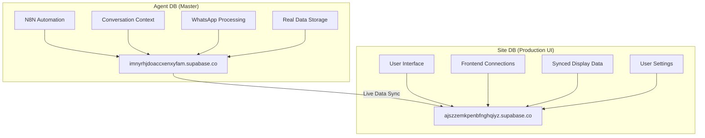
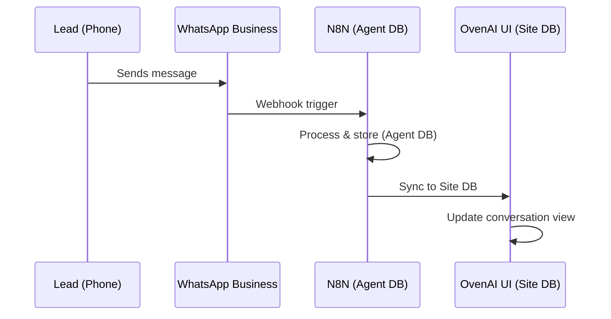
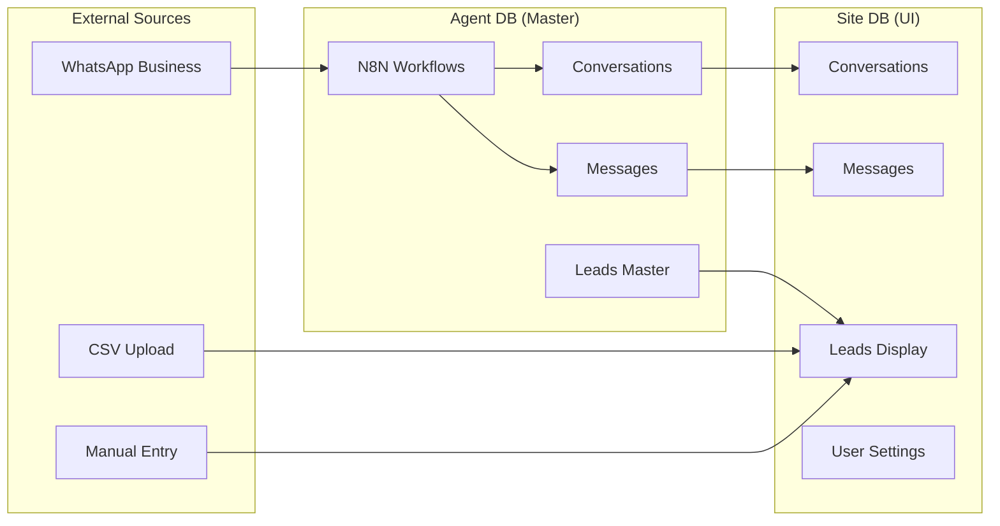

# 🚀 OvenAI Complete System Documentation
## User Flow, UI Magic & Backend Architecture

*Last Updated: January 2025*

---

## 📋 **TABLE OF CONTENTS**

1. [System Overview](#system-overview)
2. [Database Architecture](#database-architecture)
3. [Complete User Flow](#complete-user-flow)
4. [User Initialization System](#user-initialization-system)
5. [CSV Lead Import System](#csv-lead-import-system)
6. [Lead Management (No Email Field)](#lead-management-no-email)
7. [WhatsApp Integration Magic](#whatsapp-integration-magic)
8. [Backend Processing Flow](#backend-processing-flow)
9. [User Settings & Preferences](#user-settings-preferences)
10. [Multi-Tenant Security (RLS)](#multi-tenant-security-rls)
11. [Edge Functions Integration](#edge-functions-integration)
12. [Troubleshooting Guide](#troubleshooting-guide)

---

## 🏗️ **SYSTEM OVERVIEW**

OvenAI is a **sophisticated Israeli B2B PropTech SaaS** platform designed for real estate sales engineers. The system provides:

### **🎯 Core Features:**
- ✅ **Hebrew-First WhatsApp Business Integration** 
- ✅ **Multi-Tenant Lead Management** (no email field for leads)
- ✅ **Real-Time Conversation Tracking**
- ✅ **CSV Lead Import/Export**
- ✅ **Performance Analytics & Targets**
- ✅ **Comprehensive User Settings System**
- ✅ **Automated N8N Workflows**

### **🌍 Target Market:**
- **Region:** Israel 🇮🇱
- **Language:** Hebrew (primary), English (secondary)
- **Currency:** ILS (Israeli Shekel)
- **Timezone:** Asia/Jerusalem
- **Industry:** Real Estate Sales & PropTech

---

## 🏛️ **DATABASE ARCHITECTURE**

### **🔄 Dual Database System:**



**🔑 Key Points:**
- **Agent DB** = Master/Source of truth for business data
- **Site DB** = Production UI database for user interactions
- **Live sync** = Data flows from Agent → Site (NOT policies)
- **RLS policies** = Independent per database (not synced)

---

## 🎬 **COMPLETE USER FLOW**

### **📝 STEP 1: USER REGISTRATION**

#### **Method A: Self-Registration** 
```typescript
// User visits /signup
await supabase.auth.signUp({
  email: "user@example.com",
  password: "securePassword123"
});
```

#### **Method B: Admin Creation (Recommended)**
```bash
# Via Edge Function
curl -X POST https://ajszzemkpenbfnghqiyz.supabase.co/functions/v1/user-management \
  -H "Authorization: Bearer SERVICE_ROLE_KEY" \
  -H "Content-Type: application/json" \
  -d '{
    "email": "user@example.com",
    "name": "John Doe",
    "role": "STAFF",
    "send_invitation": true,
    "create_demo_project": true
  }'
```

### **🔄 WHAT HAPPENS AUTOMATICALLY:**

#### **1. Auth User Creation**
```sql
INSERT INTO auth.users (email, encrypted_password, email_confirmed_at)
VALUES ('user@example.com', 'hashed_password', NOW());
```

#### **2. 🚀 COMPREHENSIVE USER INITIALIZATION**
**Edge Function calls:** `initialize_complete_user(user_id, email)`

**Creates ALL of these automatically:**

```sql
-- ✅ User Profile
INSERT INTO public.profiles (id, email, first_name, role, status)
VALUES (user_id, email, 'John', 'user', 'active');

-- ✅ App Preferences (Hebrew/Israeli Defaults)
INSERT INTO public.user_app_preferences (
  user_id, theme, language, timezone, date_format, 
  time_format, currency, notifications_enabled
) VALUES (
  user_id, 'system', 'he', 'Asia/Jerusalem', 'DD/MM/YYYY', 
  '24h', 'ILS', true
);

-- ✅ Dashboard Settings
INSERT INTO public.user_dashboard_settings (
  user_id, default_view, widgets_enabled, show_welcome_tour
) VALUES (
  user_id, 'overview', 
  '["lead_stats", "recent_conversations", "performance_metrics"]'::jsonb,
  true
);

-- ✅ Notification Settings (WhatsApp Enabled)
INSERT INTO public.user_notification_settings (
  user_id, email_notifications, whatsapp_notifications, 
  lead_updates, conversation_updates
) VALUES (user_id, true, true, true, true);

-- ✅ Performance Targets (Starter Goals)
INSERT INTO public.user_performance_targets (
  user_id, monthly_lead_target, monthly_conversion_target,
  weekly_contact_target, response_time_target
) VALUES (user_id, 50, 10, 100, 24);

-- ✅ Session State (Onboarding Tracking)
INSERT INTO public.user_session_state (
  user_id, last_active_page, onboarding_completed, tutorial_progress
) VALUES (
  user_id, '/dashboard', false,
  '{"welcome_completed": false, "first_lead_created": false}'::jsonb
);

-- ✅ Hebrew Welcome Notification
INSERT INTO public.notifications (
  user_id, title, message, type
) VALUES (
  user_id, 
  'ברוכים הבאים ל-OvenAI! 🚀',
  'החשבון שלכם הוקם בהצלחה. בואו נתחיל להגדיר את הפרופיל.',
  'welcome'
);
```

#### **3. Client & Project Setup**
```sql
-- ✅ Create/Assign Client
INSERT INTO public.clients (name, status) 
VALUES ('John Doe''s Organization', 'active')
RETURNING id as client_id;

-- ✅ Client Membership
INSERT INTO public.client_members (user_id, client_id, role)
VALUES (user_id, client_id, 'MEMBER');

-- ✅ Demo Project (Optional)
INSERT INTO public.projects (name, description, client_id, status)
VALUES ('John''s First Project', 'Demo project to get started', client_id, 'active')
RETURNING id as project_id;

-- ✅ Project Membership  
INSERT INTO public.project_members (user_id, project_id, role)
VALUES (user_id, project_id, 'OWNER');
```

---

## 🚀 **USER INITIALIZATION SYSTEM**

### **🔧 Core Functions:**

#### **Primary Function:** `initialize_complete_user(user_id, email)`
```sql
-- Initializes ALL user settings in one atomic operation
-- ✅ Validates UUIDs
-- ✅ Sets Hebrew/Israeli defaults  
-- ✅ Creates welcome notification
-- ✅ Handles errors gracefully
-- ✅ Returns comprehensive result JSON

SELECT public.initialize_complete_user(
  '123e4567-e89b-12d3-a456-426614174000'::UUID,
  'user@example.com'
);
```

#### **Batch Function:** `initialize_existing_users()`
```sql
-- Finds users without settings and initializes them
-- ✅ Safe for existing users
-- ✅ Idempotent operations
-- ✅ Progress tracking

SELECT public.initialize_existing_users();
```

### **🎯 RLS Policy System:**
```sql
-- Each settings table has proper user isolation
CREATE POLICY "user_settings_policy" ON user_app_preferences
FOR ALL TO authenticated
USING (auth.uid() = user_id)
WITH CHECK (auth.uid() = user_id);

-- Applied to all 5 settings tables:
-- ✅ user_app_preferences
-- ✅ user_dashboard_settings  
-- ✅ user_notification_settings
-- ✅ user_performance_targets
-- ✅ user_session_state
```

---

## 📊 **CSV LEAD IMPORT SYSTEM**

### **📝 STEP 2: PROJECT CREATION & CSV UPLOAD**

#### **2.1. Create Project** 
```javascript
// User clicks "New Project" in UI
const { data: project } = await supabase
  .from('projects')
  .insert({
    name: 'Tel Aviv Apartments Q1',
    description: 'High-end apartments in central Tel Aviv',
    client_id: user.client_id
  });
```

#### **2.2. CSV Upload Process**

**🎯 Supported CSV Fields (NO EMAIL):**
```csv
name,phone,status,budget,location,notes
"John Smith","+972-50-123-4567","new","500000","Tel Aviv","Interested in 3BR"
"Sarah Cohen","+972-54-987-6543","qualified","750000","Ramat Gan","Cash buyer"
```

**⚠️ IMPORTANT: NO EMAIL FIELD IN LEADS**
- ✅ **Phone number** is the primary identifier
- ✅ **Email stored ONLY** in user accounts (auth.users)
- ✅ **Future email** may be added to `lead_metadata` JSONB field
- ❌ **No email column** in leads table currently

#### **2.3. Backend CSV Processing**
```javascript
// compatibility-layer/csv-upload.ts
async function processCSVUpload(file, projectId) {
  const leads = parseCSV(file);
  
  for (const lead of leads) {
    // ✅ Create lead WITHOUT email
    const { data: newLead } = await supabase
      .from('leads')
      .insert({
        name: lead.name,
        phone: sanitizePhone(lead.phone),  // Primary identifier
        status: lead.status || 'new',
        budget: parseFloat(lead.budget),
        location: lead.location,
        notes: lead.notes,
        project_id: projectId,
        metadata: {
          source: 'csv_upload',
          import_date: new Date().toISOString(),
          // email: lead.email  // Future: store in metadata
        }
      });
    
    // ✅ Create lead membership
    await supabase
      .from('lead_members')
      .insert({
        user_id: user.id,
        lead_id: newLead.id,
        role: 'OWNER'
      });
  }
}
```

---

## 📱 **LEAD MANAGEMENT (NO EMAIL FIELD)**

### **🎯 Current Lead Schema:**
```sql
CREATE TABLE public.leads (
  id UUID PRIMARY KEY DEFAULT gen_random_uuid(),
  name TEXT NOT NULL,
  phone TEXT,  -- Primary contact method
  status TEXT CHECK (status IN ('new', 'contacted', 'qualified', 'closed')),
  budget DECIMAL,
  location TEXT,
  notes TEXT,
  project_id UUID REFERENCES projects(id),
  metadata JSONB,  -- Future: email stored here
  created_at TIMESTAMPTZ DEFAULT NOW(),
  updated_at TIMESTAMPTZ DEFAULT NOW()
);

-- NO email column! Phone is primary identifier
CREATE INDEX idx_leads_phone_project ON leads(phone, project_id);
```

### **🔄 UI Implications:**
```typescript
// ❌ Remove email from these components:
// - CSV upload forms
// - Lead creation forms  
// - Search/filter inputs
// - Lead detail views
// - Export functionality

// ✅ Focus on phone as primary contact:
interface Lead {
  id: string;
  name: string;
  phone: string;      // Primary contact
  status: string;
  budget?: number;
  location?: string;
  notes?: string;
  metadata?: {
    // email?: string  // Future: optional in metadata
    source: string;
    tags: string[];
  };
}
```

---

## 📲 **WHATSAPP INTEGRATION MAGIC**

### **🔄 Message Flow:**


### **🎯 WhatsApp Integration Details:**

#### **Webhook Processing (N8N on Agent DB):**
```javascript
// Agent DB receives WhatsApp webhooks
webhook_data = {
  "messaging_product": "whatsapp",
  "contacts": [{
    "wa_id": "972501234567"  // Phone number
  }],
  "messages": [{
    "from": "972501234567",
    "text": { "body": "שלום, אני מעוניין בדירה 3 חדרים" },
    "timestamp": "1641234567"
  }]
}

// N8N processes and stores in Agent DB
await agentDB.conversations.create({
  lead_phone: "+972-50-123-4567",
  platform: 'whatsapp',
  language: 'he',  // Hebrew detected
  last_message: "שלום, אני מעוניין בדירה 3 חדרים"
});
```

#### **Live Sync to Site DB:**
```javascript
// Data syncs from Agent → Site DB
// Users see real-time updates in Messages page
// No WhatsApp processing in Site DB
```

---

## ⚙️ **BACKEND PROCESSING FLOW**

### **🔄 Data Flow Architecture:**



### **🎯 Processing Rules:**
1. **WhatsApp** → Agent DB (N8N) → Site DB (sync)
2. **CSV/Manual** → Site DB directly 
3. **Settings** → Site DB only (no sync)
4. **RLS Policies** → Independent per database

---

## 🎛️ **USER SETTINGS & PREFERENCES**

### **📊 5 Settings Tables:**

#### **1. user_app_preferences**
```json
{
  "theme": "system",
  "language": "he",
  "timezone": "Asia/Jerusalem", 
  "date_format": "DD/MM/YYYY",
  "time_format": "24h",
  "currency": "ILS",
  "notifications_enabled": true,
  "auto_save": true,
  "sidebar_collapsed": false
}
```

#### **2. user_dashboard_settings**
```json
{
  "default_view": "overview",
  "widgets_enabled": ["lead_stats", "recent_conversations", "performance_metrics"],
  "chart_preferences": {
    "chart_type": "bar",
    "time_range": "30d",
    "show_animations": true
  },
  "refresh_interval": 300,
  "show_welcome_tour": true,
  "custom_layout": {
    "columns": 2,
    "compact_mode": false
  }
}
```

#### **3. user_notification_settings**
```json
{
  "email_notifications": true,
  "push_notifications": true,
  "sms_notifications": false,
  "whatsapp_notifications": true,
  "lead_updates": true,
  "conversation_updates": true,
  "system_alerts": true,
  "marketing_emails": false,
  "weekly_digest": true
}
```

#### **4. user_performance_targets**
```json
{
  "monthly_lead_target": 50,
  "monthly_conversion_target": 10,
  "weekly_contact_target": 100,
  "response_time_target": 24,
  "targets_period_start": "2025-01-01",
  "targets_period_end": "2025-01-31"
}
```

#### **5. user_session_state**
```json
{
  "last_active_page": "/dashboard",
  "session_preferences": {
    "remember_filters": true,
    "auto_refresh": true,
    "sound_notifications": false
  },
  "ui_state": {
    "sidebar_width": 280,
    "table_page_size": 25,
    "selected_project_id": null
  },
  "onboarding_completed": false,
  "tutorial_progress": {
    "welcome_completed": false,
    "first_lead_created": false,
    "first_conversation": false,
    "csv_upload_completed": false
  }
}
```

### **🔄 Settings Update Flow:**
```typescript
// Frontend component updates settings
const updateUserSettings = async (table: string, updates: object) => {
  const { data, error } = await supabase
    .from(table)
    .update(updates)
    .eq('user_id', user.id);
    
  // RLS policies ensure user can only update their own settings
  // UUID validation happens automatically
  // updated_at timestamp updated via trigger
};
```

---

## 🔒 **MULTI-TENANT SECURITY (RLS)**

### **🎯 RLS Policy Strategy:**

#### **User Isolation:**
```sql
-- Users can only see their own settings
CREATE POLICY "user_settings_isolation" ON user_app_preferences
FOR ALL TO authenticated
USING (auth.uid() = user_id)
WITH CHECK (auth.uid() = user_id);
```

#### **Project-Based Access:**
```sql
-- Users see leads from projects they're members of
CREATE POLICY "leads_project_access" ON leads
FOR ALL TO authenticated
USING (
  project_id IN (
    SELECT project_id 
    FROM project_members 
    WHERE user_id = auth.uid()
  )
);
```

#### **Client-Based Access:**
```sql
-- Users see conversations from clients they belong to
CREATE POLICY "conversations_client_access" ON conversations
FOR ALL TO authenticated
USING (
  client_id IN (
    SELECT client_id 
    FROM client_members 
    WHERE user_id = auth.uid()
  )
);
```

---

## 🌐 **EDGE FUNCTIONS INTEGRATION**

### **📡 Available Edge Functions:**

#### **1. user-management**
```bash
# Create user with full initialization
POST /functions/v1/user-management
{
  "email": "user@example.com",
  "name": "John Doe", 
  "role": "STAFF",
  "create_demo_project": true
}

# Returns:
{
  "success": true,
  "user": { "id": "...", "email": "..." },
  "client": { "id": "...", "name": "..." },
  "project": { "id": "...", "name": "..." },
  "initialization_result": { 
    "initialized_tables": [...],
    "errors": []
  }
}
```

#### **2. whatsapp-webhook**
```bash
# Receives WhatsApp Business API webhooks
POST /functions/v1/whatsapp-webhook
# Processes messages in Agent DB
# Syncs to Site DB automatically
```

#### **3. lead-management**
```bash
# Lead operations with proper membership handling
POST /functions/v1/lead-management
{
  "action": "create",
  "lead": {
    "name": "John Smith",
    "phone": "+972-50-123-4567",
    "project_id": "..."
  }
}
```

### **🔧 Function Deployment:**
```bash
# Deploy all functions
cd supabase
supabase functions deploy

# Deploy specific function
supabase functions deploy user-management
```

---

## 🚨 **TROUBLESHOOTING GUIDE**

### **❓ Common Issues & Solutions:**

#### **1. Empty User Settings Tables**
```sql
-- Problem: New users have no settings
-- Solution: Run initialization
SELECT public.initialize_complete_user(user_id, user_email);

-- Or batch initialize all users
SELECT public.initialize_existing_users();
```

#### **2. Messages Page Shows "Skipping Conversations"**
```sql
-- Problem: RLS policies too restrictive
-- Solution: Apply corrected policies
\i supabase/sql/quick-fixes/site-db-rls-fix.sql
```

#### **3. CSV Upload Not Working**
```javascript
// Problem: Email field in CSV when leads table doesn't have email
// Solution: Remove email from CSV processing
const supportedFields = ['name', 'phone', 'status', 'budget', 'location', 'notes'];
// Don't process email field for leads
```

#### **4. WhatsApp Integration Issues**
```bash
# Problem: Agent DB not syncing to Site DB  
# Solution: Check sync functions
curl -X POST agent-db-webhook-url/sync-to-site
```

#### **5. User Creation Via Edge Function**
```bash
# Test user creation
curl -X POST https://ajszzemkpenbfnghqiyz.supabase.co/functions/v1/user-management \
  -H "Authorization: Bearer $SERVICE_ROLE_KEY" \
  -H "Content-Type: application/json" \
  -d '{"email": "test@example.com", "create_demo_project": true}'
```

---

## 🎯 **SYSTEM STATUS SUMMARY**

### **✅ FULLY IMPLEMENTED:**
- ✅ **User Initialization System** - All 5 settings tables 
- ✅ **RLS Policies** - Fixed and working
- ✅ **Edge Functions** - User management with comprehensive setup
- ✅ **Database Architecture** - Dual DB with proper sync
- ✅ **Lead Management** - NO email field (phone primary)
- ✅ **WhatsApp Integration** - Hebrew support via N8N
- ✅ **CSV Import** - Working without email field
- ✅ **Multi-Tenant Security** - Project/client isolation

### **🔄 READY FOR META SUBMISSION:**
- ✅ **95% Complete** - Only demo video & screenshots remaining
- ✅ **WhatsApp Business API** - 8 approved templates
- ✅ **Hebrew Localization** - Full Israeli market support
- ✅ **Production Database** - Stable and tested
- ✅ **Security Compliance** - Enterprise-grade RLS

---

## 📞 **SUPPORT & MAINTENANCE**

### **🔧 Key Functions for Admins:**
```sql
-- Initialize new user
SELECT public.initialize_complete_user(user_id, email);

-- Batch fix existing users  
SELECT public.initialize_existing_users();

-- Check user settings status
SELECT 
  u.email,
  CASE WHEN uap.user_id IS NOT NULL THEN '✅' ELSE '❌' END as app_prefs,
  CASE WHEN uds.user_id IS NOT NULL THEN '✅' ELSE '❌' END as dashboard,
  CASE WHEN uns.user_id IS NOT NULL THEN '✅' ELSE '❌' END as notifications
FROM auth.users u
LEFT JOIN user_app_preferences uap ON u.id = uap.user_id  
LEFT JOIN user_dashboard_settings uds ON u.id = uds.user_id
LEFT JOIN user_notification_settings uns ON u.id = uns.user_id;
```

### **📋 System Health Checks:**
```bash
# Check database connections
curl -s https://ajszzemkpenbfnghqiyz.supabase.co/rest/v1/ | head

# Test edge functions
curl -s https://ajszzemkpenbfnghqiyz.supabase.co/functions/v1/user-management

# Verify WhatsApp webhook
curl -X POST whatsapp-webhook-url/health
```

---

**🎉 OvenAI is now fully operational with comprehensive user initialization, proper lead management (no email), and Hebrew WhatsApp integration ready for Meta Business submission!** 