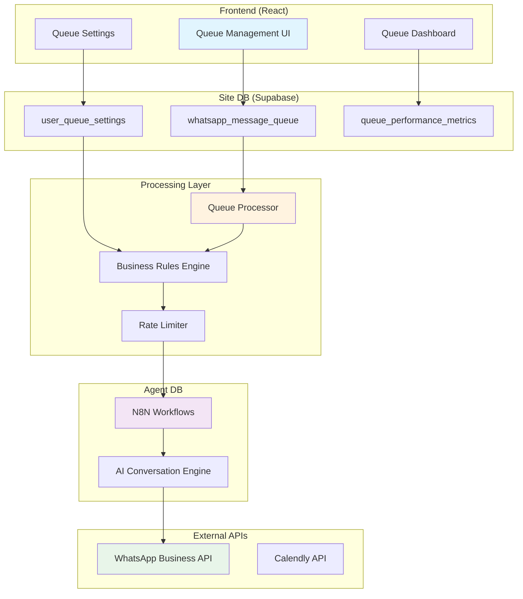

# 🔧 Leads Queue Technical Implementation Guide
**Companion to the Feature Specification v1.0**

---

## 🏗️ Architecture Overview



---

## 📁 File Structure

```
src/
├── components/
│   └── queue/
│       ├── QueueManagementDashboard.tsx    # Main UI component
│       ├── QueueSettingsPanel.tsx          # Configuration UI
│       ├── QueueMetricsDisplay.tsx         # Real-time metrics
│       ├── LeadSelectionGrid.tsx           # Lead picker
│       └── QueueProcessingStatus.tsx       # Status monitor
│
├── services/
│   └── queue/
│       ├── queueService.ts                 # Core queue operations
│       ├── queueProcessor.ts               # Processing engine
│       ├── businessRulesEngine.ts          # Rules enforcement
│       └── queueMetricsService.ts          # Analytics
│
├── hooks/
│   ├── useQueueStatus.ts                   # Real-time status
│   ├── useQueueSettings.ts                 # Settings management
│   └── useQueueMetrics.ts                  # Performance data
│
├── types/
│   └── queue.ts                            # TypeScript definitions
│
└── pages/
    └── admin/
        └── QueueManagement.tsx             # Main queue page
```

---

## 💻 Component Implementation

### **1. Queue Management Dashboard**

```typescript
// src/components/queue/QueueManagementDashboard.tsx
import React, { useState, useEffect } from 'react';
import { useTranslation } from 'react-i18next';
import { useLang } from '@/hooks/useLang';
import { useQueueStatus } from '@/hooks/useQueueStatus';
import { useQueueSettings } from '@/hooks/useQueueSettings';
import { Card, CardContent, CardHeader, CardTitle } from '@/components/ui/card';
import { Button } from '@/components/ui/button';
import { Badge } from '@/components/ui/badge';
import { Alert, AlertDescription } from '@/components/ui/alert';
import { 
  Play, 
  Pause, 
  RefreshCw, 
  Clock, 
  CheckCircle, 
  AlertTriangle 
} from 'lucide-react';

interface QueuedLead {
  id: string;
  leadId: string;
  leadName: string;
  phone: string;
  status: 'pending' | 'queued' | 'processing' | 'sent' | 'failed';
  priority: 'low' | 'normal' | 'high' | 'immediate';
  scheduledFor?: Date;
  error?: string;
}

export const QueueManagementDashboard: React.FC = () => {
  const { t } = useTranslation(['pages', 'common']);
  const { isRTL } = useLang();
  const { queueStatus, isProcessing, startProcessing, pauseProcessing } = useQueueStatus();
  const { settings } = useQueueSettings();
  const [queuedLeads, setQueuedLeads] = useState<QueuedLead[]>([]);
  const [selectedLeadIds, setSelectedLeadIds] = useState<string[]>([]);

  // Real-time queue updates
  useEffect(() => {
    const subscription = supabase
      .channel('queue-updates')
      .on('postgres_changes', 
        { event: '*', schema: 'public', table: 'whatsapp_message_queue' },
        (payload) => {
          handleQueueUpdate(payload);
        }
      )
      .subscribe();

    return () => {
      subscription.unsubscribe();
    };
  }, []);

  const handleBulkQueue = async () => {
    try {
      const result = await queueService.bulkQueueLeads({
        leadIds: selectedLeadIds,
        priority: 'normal',
        scheduledFor: new Date(),
      });
      
      toast.success(`${result.queued} leads added to queue`);
      setSelectedLeadIds([]);
    } catch (error) {
      toast.error('Failed to queue leads');
    }
  };

  const getStatusBadge = (status: string) => {
    const variants: Record<string, { color: string; icon: React.ReactNode }> = {
      pending: { color: 'secondary', icon: <Clock className="h-3 w-3" /> },
      processing: { color: 'default', icon: <RefreshCw className="h-3 w-3 animate-spin" /> },
      sent: { color: 'success', icon: <CheckCircle className="h-3 w-3" /> },
      failed: { color: 'destructive', icon: <AlertTriangle className="h-3 w-3" /> },
    };

    const variant = variants[status] || variants.pending;
    
    return (
      <Badge variant={variant.color as any} className="flex items-center gap-1">
        {variant.icon}
        {t(`queue.status.${status}`)}
      </Badge>
    );
  };

  return (
    <div className={`space-y-6 ${isRTL ? 'rtl' : 'ltr'}`}>
      {/* Queue Controls */}
      <Card>
        <CardHeader>
          <CardTitle>{t('queue.title')}</CardTitle>
        </CardHeader>
        <CardContent>
          <div className="flex items-center justify-between">
            <div className="flex items-center gap-2">
              {isProcessing ? (
                <Button onClick={pauseProcessing} variant="outline">
                  <Pause className="h-4 w-4 mr-2" />
                  {t('queue.actions.pause')}
                </Button>
              ) : (
                <Button onClick={startProcessing}>
                  <Play className="h-4 w-4 mr-2" />
                  {t('queue.actions.start')}
                </Button>
              )}
              
              <Button 
                onClick={handleBulkQueue}
                disabled={selectedLeadIds.length === 0}
              >
                {t('queue.actions.queue')} ({selectedLeadIds.length})
              </Button>
            </div>

            <div className="text-sm text-muted-foreground">
              {t('queue.metrics.in_queue')}: {queueStatus.depth}
            </div>
          </div>
        </CardContent>
      </Card>

      {/* Queue List */}
      <Card>
        <CardContent className="p-0">
          <div className="divide-y">
            {queuedLeads.map((lead) => (
              <div key={lead.id} className="p-4 hover:bg-muted/50">
                <div className="flex items-center justify-between">
                  <div>
                    <p className="font-medium">{lead.leadName}</p>
                    <p className="text-sm text-muted-foreground">{lead.phone}</p>
                  </div>
                  <div className="flex items-center gap-2">
                    <Badge variant={lead.priority === 'high' ? 'destructive' : 'secondary'}>
                      {t(`queue.priority.${lead.priority}`)}
                    </Badge>
                    {getStatusBadge(lead.status)}
                  </div>
                </div>
                {lead.error && (
                  <Alert className="mt-2">
                    <AlertTriangle className="h-4 w-4" />
                    <AlertDescription>{lead.error}</AlertDescription>
                  </Alert>
                )}
              </div>
            ))}
          </div>
        </CardContent>
      </Card>
    </div>
  );
};
```

### **2. Queue Service Implementation**

```typescript
// src/services/queue/queueService.ts
import { supabase } from '@/integrations/supabase/client';
import { businessRulesEngine } from './businessRulesEngine';
import { rateLimiter } from './rateLimiter';

export interface QueueOperation {
  leadIds: string[];
  priority?: 'low' | 'normal' | 'high' | 'immediate';
  scheduledFor?: Date;
}

class QueueService {
  async bulkQueueLeads(operation: QueueOperation): Promise<QueueResult> {
    try {
      // Validate business rules
      const validation = await businessRulesEngine.validateOperation(operation);
      if (!validation.allowed) {
        throw new Error(validation.reason);
      }

      // Check rate limits
      const rateCheck = await rateLimiter.checkLimit(operation.leadIds.length);
      if (!rateCheck.allowed) {
        throw new Error(`Rate limit exceeded. Try again in ${rateCheck.retryAfter}s`);
      }

      // Prepare queue entries
      const queueEntries = operation.leadIds.map(leadId => ({
        lead_id: leadId,
        client_id: this.getCurrentClientId(),
        user_id: this.getCurrentUserId(),
        status: 'pending',
        priority: operation.priority || 'normal',
        scheduled_for: operation.scheduledFor || new Date(),
        message_template: 'initial_outreach', // Would be dynamic
        message_variables: {},
      }));

      // Bulk insert
      const { data, error } = await supabase
        .from('whatsapp_message_queue')
        .insert(queueEntries)
        .select();

      if (error) throw error;

      // Update metrics
      await this.updateQueueMetrics({
        leads_queued: data.length,
      });

      // Trigger Agent DB if immediate priority
      const immediateleads = data.filter(d => d.priority === 'immediate');
      if (immediateleads.length > 0) {
        await this.triggerAgentDB(immediateleads);
      }

      return {
        success: true,
        queued: data.length,
        queueIds: data.map(d => d.id),
      };
    } catch (error) {
      console.error('Queue operation failed:', error);
      throw error;
    }
  }

  async processQueue(): Promise<void> {
    try {
      // Get next batch
      const { data: batch, error } = await supabase
        .from('whatsapp_message_queue')
        .select('*')
        .eq('status', 'pending')
        .lte('scheduled_for', new Date().toISOString())
        .order('priority', { ascending: false })
        .order('scheduled_for', { ascending: true })
        .limit(this.getBatchSize());

      if (error) throw error;
      if (!batch || batch.length === 0) return;

      // Process each message
      for (const message of batch) {
        await this.processMessage(message);
      }
    } catch (error) {
      console.error('Queue processing error:', error);
    }
  }

  private async processMessage(message: QueueMessage): Promise<void> {
    try {
      // Update status to processing
      await this.updateMessageStatus(message.id, 'processing');

      // Apply processing delay
      await this.applyProcessingDelay();

      // Trigger Agent DB
      const result = await this.triggerAgentDB([message]);

      if (result.success) {
        await this.updateMessageStatus(message.id, 'sent', {
          agent_trigger_id: result.triggerId,
          processed_at: new Date(),
        });
      } else {
        throw new Error(result.error);
      }
    } catch (error) {
      await this.handleMessageError(message, error);
    }
  }

  private async triggerAgentDB(messages: QueueMessage[]): Promise<TriggerResult> {
    // Integration with Agent DB N8N webhook
    const payload = {
      event: 'lead_batch_ready',
      leads: messages.map(m => ({
        lead_id: m.lead_id,
        priority: m.priority,
        template: m.message_template,
        variables: m.message_variables,
      })),
      metadata: {
        triggered_by: 'queue_processor',
        timestamp: new Date().toISOString(),
      },
    };

    // Send to Agent DB webhook
    const response = await fetch(process.env.AGENT_DB_WEBHOOK_URL, {
      method: 'POST',
      headers: {
        'Content-Type': 'application/json',
        'Authorization': `Bearer ${process.env.AGENT_DB_API_KEY}`,
      },
      body: JSON.stringify(payload),
    });

    if (!response.ok) {
      throw new Error(`Agent DB trigger failed: ${response.statusText}`);
    }

    return await response.json();
  }
}

export const queueService = new QueueService();
```

### **3. Business Rules Engine**

```typescript
// src/services/queue/businessRulesEngine.ts
import { addHours, isWithinInterval, getDay } from 'date-fns';
import { utcToZonedTime } from 'date-fns-tz';

interface BusinessRules {
  businessHours: Record<string, { start: string; end: string; enabled: boolean }>;
  holidays: string[];
  dailyTarget: number;
  maxCapacity: number;
  timezone: string;
}

class BusinessRulesEngine {
  private rules: BusinessRules = {
    businessHours: {
      sunday: { start: '09:00', end: '17:00', enabled: true },
      monday: { start: '09:00', end: '17:00', enabled: true },
      tuesday: { start: '09:00', end: '17:00', enabled: true },
      wednesday: { start: '09:00', end: '17:00', enabled: true },
      thursday: { start: '09:00', end: '17:00', enabled: true },
      friday: { start: '09:00', end: '13:00', enabled: false },
      saturday: { enabled: false },
    },
    holidays: [
      '2024-04-22', // Passover
      '2024-09-15', // Rosh Hashanah
      '2024-09-24', // Yom Kippur
      // Add more Jewish holidays
    ],
    dailyTarget: 45,
    maxCapacity: 200,
    timezone: 'Asia/Jerusalem',
  };

  async validateOperation(operation: QueueOperation): Promise<ValidationResult> {
    const checks = [
      this.checkBusinessHours(operation.scheduledFor),
      this.checkDailyCapacity(operation.leadIds.length),
      this.checkHolidays(operation.scheduledFor),
    ];

    const results = await Promise.all(checks);
    const failed = results.find(r => !r.allowed);

    return failed || { allowed: true };
  }

  private checkBusinessHours(scheduledFor?: Date): ValidationResult {
    const targetTime = scheduledFor || new Date();
    const israelTime = utcToZonedTime(targetTime, this.rules.timezone);
    
    const dayOfWeek = getDay(israelTime);
    const dayName = ['sunday', 'monday', 'tuesday', 'wednesday', 'thursday', 'friday', 'saturday'][dayOfWeek];
    const dayRules = this.rules.businessHours[dayName];

    if (!dayRules.enabled) {
      return { 
        allowed: false, 
        reason: `Cannot schedule for ${dayName} - business closed` 
      };
    }

    const hours = israelTime.getHours();
    const minutes = israelTime.getMinutes();
    const timeString = `${hours.toString().padStart(2, '0')}:${minutes.toString().padStart(2, '0')}`;
    
    if (timeString < dayRules.start || timeString > dayRules.end) {
      return { 
        allowed: false, 
        reason: `Outside business hours (${dayRules.start}-${dayRules.end} IST)` 
      };
    }

    return { allowed: true };
  }

  private async checkDailyCapacity(additionalLeads: number): Promise<ValidationResult> {
    const today = new Date().toISOString().split('T')[0];
    
    const { count } = await supabase
      .from('whatsapp_message_queue')
      .select('*', { count: 'exact', head: true })
      .gte('created_at', today)
      .in('status', ['pending', 'queued', 'processing', 'sent']);

    const totalForToday = (count || 0) + additionalLeads;
    
    if (totalForToday > this.rules.maxCapacity) {
      return { 
        allowed: false, 
        reason: `Daily capacity exceeded (${totalForToday}/${this.rules.maxCapacity})` 
      };
    }

    if (totalForToday > this.rules.dailyTarget) {
      return { 
        allowed: true, 
        warning: `Exceeding daily target (${totalForToday}/${this.rules.dailyTarget})` 
      };
    }

    return { allowed: true };
  }

  private checkHolidays(scheduledFor?: Date): ValidationResult {
    const targetDate = (scheduledFor || new Date()).toISOString().split('T')[0];
    
    if (this.rules.holidays.includes(targetDate)) {
      return { 
        allowed: false, 
        reason: 'Cannot schedule on holidays' 
      };
    }

    return { allowed: true };
  }
}

export const businessRulesEngine = new BusinessRulesEngine();
```

### **4. Real-time Queue Hook**

```typescript
// src/hooks/useQueueStatus.ts
import { useState, useEffect } from 'react';
import { supabase } from '@/integrations/supabase/client';

interface QueueStatus {
  depth: number;
  processing: number;
  completed: number;
  failed: number;
  successRate: number;
}

export const useQueueStatus = () => {
  const [queueStatus, setQueueStatus] = useState<QueueStatus>({
    depth: 0,
    processing: 0,
    completed: 0,
    failed: 0,
    successRate: 0,
  });
  const [isProcessing, setIsProcessing] = useState(false);

  useEffect(() => {
    // Initial load
    loadQueueStatus();

    // Subscribe to changes
    const subscription = supabase
      .channel('queue-status')
      .on('postgres_changes', 
        { event: '*', schema: 'public', table: 'whatsapp_message_queue' },
        () => {
          loadQueueStatus();
        }
      )
      .subscribe();

    // Polling for real-time metrics
    const interval = setInterval(loadQueueStatus, 5000);

    return () => {
      subscription.unsubscribe();
      clearInterval(interval);
    };
  }, []);

  const loadQueueStatus = async () => {
    try {
      const [pending, processing, completed, failed] = await Promise.all([
        supabase
          .from('whatsapp_message_queue')
          .select('*', { count: 'exact', head: true })
          .eq('status', 'pending'),
        supabase
          .from('whatsapp_message_queue')
          .select('*', { count: 'exact', head: true })
          .eq('status', 'processing'),
        supabase
          .from('whatsapp_message_queue')
          .select('*', { count: 'exact', head: true })
          .eq('status', 'sent')
          .gte('processed_at', new Date(Date.now() - 24 * 60 * 60 * 1000).toISOString()),
        supabase
          .from('whatsapp_message_queue')
          .select('*', { count: 'exact', head: true })
          .eq('status', 'failed')
          .gte('updated_at', new Date(Date.now() - 24 * 60 * 60 * 1000).toISOString()),
      ]);

      const total = (completed.count || 0) + (failed.count || 0);
      const successRate = total > 0 ? ((completed.count || 0) / total) * 100 : 0;

      setQueueStatus({
        depth: pending.count || 0,
        processing: processing.count || 0,
        completed: completed.count || 0,
        failed: failed.count || 0,
        successRate: Math.round(successRate),
      });

      setIsProcessing((processing.count || 0) > 0);
    } catch (error) {
      console.error('Failed to load queue status:', error);
    }
  };

  const startProcessing = async () => {
    // Trigger queue processor
    await fetch('/api/queue/start', { method: 'POST' });
    setIsProcessing(true);
  };

  const pauseProcessing = async () => {
    // Pause queue processor
    await fetch('/api/queue/pause', { method: 'POST' });
    setIsProcessing(false);
  };

  return {
    queueStatus,
    isProcessing,
    startProcessing,
    pauseProcessing,
    refresh: loadQueueStatus,
  };
};
```

---

## 🧪 Testing Strategy

### **Unit Tests**

```typescript
// src/services/queue/__tests__/businessRulesEngine.test.ts
import { businessRulesEngine } from '../businessRulesEngine';

describe('BusinessRulesEngine', () => {
  describe('Business Hours Validation', () => {
    it('should allow queueing during business hours', async () => {
      const monday9am = new Date('2024-01-15T09:00:00+02:00');
      const result = await businessRulesEngine.validateOperation({
        leadIds: ['123'],
        scheduledFor: monday9am,
      });
      expect(result.allowed).toBe(true);
    });

    it('should reject queueing on Saturday', async () => {
      const saturday = new Date('2024-01-13T10:00:00+02:00');
      const result = await businessRulesEngine.validateOperation({
        leadIds: ['123'],
        scheduledFor: saturday,
      });
      expect(result.allowed).toBe(false);
      expect(result.reason).toContain('business closed');
    });

    it('should reject queueing outside business hours', async () => {
      const monday8pm = new Date('2024-01-15T20:00:00+02:00');
      const result = await businessRulesEngine.validateOperation({
        leadIds: ['123'],
        scheduledFor: monday8pm,
      });
      expect(result.allowed).toBe(false);
      expect(result.reason).toContain('Outside business hours');
    });
  });

  describe('Capacity Validation', () => {
    it('should warn when exceeding daily target', async () => {
      // Mock database response
      jest.spyOn(supabase, 'from').mockReturnValue({
        select: jest.fn().mockReturnValue({
          gte: jest.fn().mockReturnValue({
            in: jest.fn().mockResolvedValue({ count: 40 }),
          }),
        }),
      });

      const result = await businessRulesEngine.validateOperation({
        leadIds: Array(10).fill('123'), // 40 + 10 = 50 > 45 target
      });
      
      expect(result.allowed).toBe(true);
      expect(result.warning).toContain('Exceeding daily target');
    });
  });
});
```

### **Integration Tests**

```typescript
// tests/e2e/queue-management.spec.ts
import { test, expect } from '@playwright/test';

test.describe('Queue Management E2E', () => {
  test.beforeEach(async ({ page }) => {
    await page.goto('/login');
    await page.fill('[name="email"]', 'test@test.test');
    await page.fill('[name="password"]', 'testtesttest');
    await page.click('button[type="submit"]');
    await page.waitForURL('/dashboard');
  });

  test('should queue leads successfully', async ({ page }) => {
    await page.goto('/admin/queue-management');
    
    // Select leads
    await page.click('[data-testid="lead-checkbox-1"]');
    await page.click('[data-testid="lead-checkbox-2"]');
    
    // Set priority
    await page.click('[data-testid="priority-select"]');
    await page.click('[data-testid="priority-high"]');
    
    // Queue leads
    await page.click('[data-testid="queue-button"]');
    
    // Verify success
    await expect(page.locator('.toast-success')).toContainText('2 leads added to queue');
    await expect(page.locator('[data-testid="queue-depth"]')).toContainText('2');
  });

  test('should respect business hours', async ({ page }) => {
    // Set time to Saturday
    await page.addInitScript(() => {
      const saturday = new Date('2024-01-13T10:00:00+02:00');
      Date.now = () => saturday.getTime();
    });

    await page.goto('/admin/queue-management');
    await page.click('[data-testid="lead-checkbox-1"]');
    await page.click('[data-testid="queue-button"]');
    
    // Verify rejection
    await expect(page.locator('.toast-error')).toContainText('business closed');
  });
});
```

---

## 🚀 Deployment Checklist

### **Database Migration**

```sql
-- migrations/001_create_queue_tables.sql
BEGIN;

-- Create queue table
CREATE TABLE IF NOT EXISTS whatsapp_message_queue (
    id UUID PRIMARY KEY DEFAULT gen_random_uuid(),
    lead_id UUID NOT NULL REFERENCES leads(id),
    client_id UUID NOT NULL REFERENCES clients(id),
    user_id UUID NOT NULL REFERENCES auth.users(id),
    status TEXT CHECK (status IN ('pending', 'queued', 'processing', 'sent', 'failed', 'cancelled')),
    priority TEXT DEFAULT 'normal' CHECK (priority IN ('low', 'normal', 'high', 'immediate')),
    scheduled_for TIMESTAMPTZ,
    queued_at TIMESTAMPTZ DEFAULT NOW(),
    processed_at TIMESTAMPTZ,
    message_template TEXT NOT NULL,
    message_variables JSONB DEFAULT '{}',
    attempts INTEGER DEFAULT 0,
    last_error TEXT,
    error_code TEXT,
    agent_trigger_id TEXT,
    agent_conversation_id TEXT,
    created_at TIMESTAMPTZ DEFAULT NOW(),
    updated_at TIMESTAMPTZ DEFAULT NOW()
);

-- Create indexes
CREATE INDEX idx_queue_status_priority ON whatsapp_message_queue(status, priority DESC, scheduled_for ASC);
CREATE INDEX idx_queue_lead_id ON whatsapp_message_queue(lead_id);
CREATE INDEX idx_queue_user_id ON whatsapp_message_queue(user_id);

-- Enable RLS
ALTER TABLE whatsapp_message_queue ENABLE ROW LEVEL SECURITY;

-- RLS Policies
CREATE POLICY "Users can view their own queue items" ON whatsapp_message_queue
    FOR SELECT USING (auth.uid() = user_id);

CREATE POLICY "Users can create queue items" ON whatsapp_message_queue
    FOR INSERT WITH CHECK (auth.uid() = user_id);

CREATE POLICY "Users can update their own queue items" ON whatsapp_message_queue
    FOR UPDATE USING (auth.uid() = user_id);

-- Create settings table
CREATE TABLE IF NOT EXISTS user_queue_settings (
    -- ... (full schema from spec)
);

-- Create metrics table
CREATE TABLE IF NOT EXISTS queue_performance_metrics (
    -- ... (full schema from spec)
);

COMMIT;
```

### **Environment Variables**

```bash
# .env.production
AGENT_DB_WEBHOOK_URL=https://imnyrhjdoaccxenxyfam.supabase.co/functions/v1/queue-trigger
AGENT_DB_API_KEY=your-agent-db-api-key
QUEUE_PROCESSOR_INTERVAL=60000 # 1 minute
QUEUE_BATCH_SIZE=10
QUEUE_PROCESSING_DELAY=2000 # 2 seconds
WHATSAPP_RATE_LIMIT_PER_HOUR=1000
```

### **Background Job Setup**

```typescript
// src/jobs/queueProcessor.ts
import { CronJob } from 'cron';
import { queueService } from '@/services/queue/queueService';

// Run every minute during business hours
const queueProcessorJob = new CronJob(
  '* 9-17 * * 0-4', // Every minute, 9 AM - 5 PM, Sunday-Thursday
  async () => {
    try {
      await queueService.processQueue();
    } catch (error) {
      console.error('Queue processor error:', error);
    }
  },
  null,
  true,
  'Asia/Jerusalem'
);

export { queueProcessorJob };
```

---

## 📊 Monitoring & Alerts

### **Key Metrics to Track**
1. **Queue Depth**: Alert if > 500
2. **Processing Rate**: Alert if < 20 leads/hour
3. **Failure Rate**: Alert if > 10%
4. **API Errors**: Alert on repeated 429s
5. **Business Hours Violations**: Log attempts outside hours

### **Monitoring Dashboard SQL**

```sql
-- Real-time queue status
SELECT 
    status,
    COUNT(*) as count,
    AVG(EXTRACT(EPOCH FROM (NOW() - queued_at))) as avg_age_seconds
FROM whatsapp_message_queue
WHERE created_at >= NOW() - INTERVAL '24 hours'
GROUP BY status;

-- Hourly throughput
SELECT 
    DATE_TRUNC('hour', processed_at) as hour,
    COUNT(*) as messages_sent,
    SUM(CASE WHEN status = 'failed' THEN 1 ELSE 0 END) as failures,
    AVG(attempts) as avg_attempts
FROM whatsapp_message_queue
WHERE processed_at >= NOW() - INTERVAL '24 hours'
GROUP BY hour
ORDER BY hour DESC;

-- User performance
SELECT 
    u.email,
    COUNT(*) as total_queued,
    SUM(CASE WHEN q.status = 'sent' THEN 1 ELSE 0 END) as sent,
    SUM(CASE WHEN q.status = 'failed' THEN 1 ELSE 0 END) as failed,
    ROUND(100.0 * SUM(CASE WHEN q.status = 'sent' THEN 1 ELSE 0 END) / COUNT(*), 2) as success_rate
FROM whatsapp_message_queue q
JOIN auth.users u ON q.user_id = u.id
WHERE q.created_at >= NOW() - INTERVAL '7 days'
GROUP BY u.email
ORDER BY total_queued DESC;
```

---

## 🔒 Security Considerations

1. **RLS Policies**: Ensure users can only access their own queue items
2. **API Key Management**: Store Agent DB keys securely
3. **Rate Limiting**: Implement at application level
4. **Input Validation**: Sanitize all user inputs
5. **Audit Logging**: Track all queue operations
6. **GDPR Compliance**: Implement data retention policies

---

## 🎯 Performance Optimization

1. **Database Indexes**: Critical for queue queries
2. **Batch Processing**: Process multiple leads together
3. **Connection Pooling**: Reuse database connections
4. **Caching**: Cache user settings and business rules
5. **Lazy Loading**: Load queue items progressively
6. **WebSocket Updates**: Real-time without polling

---

**Technical Guide Version**: 1.0  
**Last Updated**: January 2024  
**Next Review**: February 2024  
**Technical Owner**: OvenAI Engineering Team 