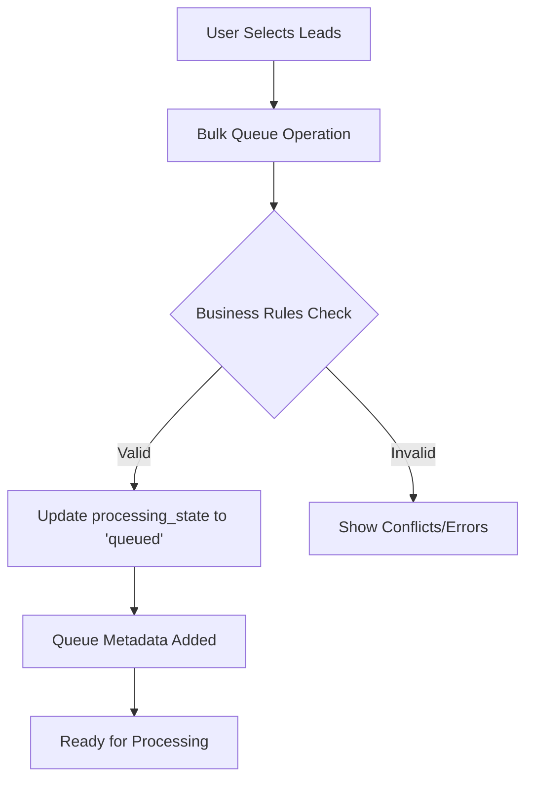
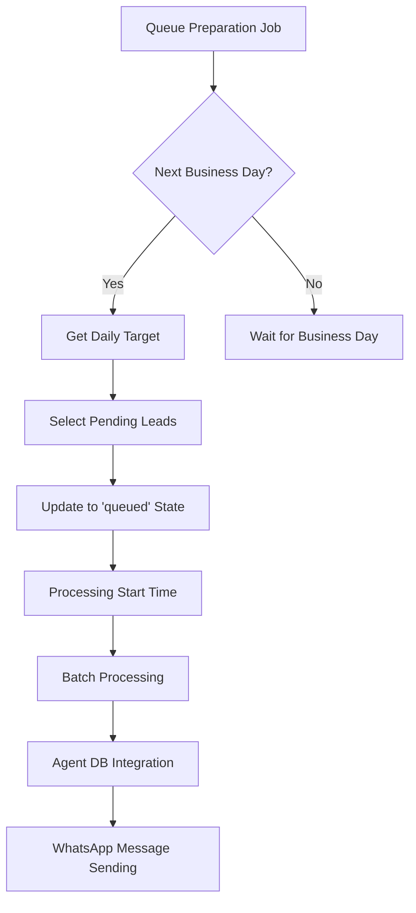

# 🔄 Queue System - Current Implementation Guide

> **Status**: ✅ **PRODUCTION READY** - Fully implemented and operational  
> **Last Verified**: January 28, 2025  
> **Database**: Site DB with Agent DB integration  
> **Implementation**: TypeScript services + Supabase tables

---

## 📋 **IMPLEMENTATION OVERVIEW**

### **What Actually Exists:**
- ✅ **Complete Queue System**: Fully implemented with TypeScript services
- ✅ **Database Tables**: `user_queue_settings`, `whatsapp_message_queue`, `queue_performance_metrics`
- ✅ **Processing Services**: `LeadProcessingService`, `QueueAnalyticsService`
- ✅ **Business Logic**: Israeli business hours, processing targets, automation
- ✅ **Real-Time Monitoring**: Queue metrics and performance tracking

### **Key Features Working:**
- **Bulk Lead Queueing**: Select and queue multiple leads for processing
- **Business Hours Compliance**: Respects Israeli work days and holidays
- **Processing Automation**: Auto-queue preparation and batch processing
- **Priority Management**: Heat score-based lead prioritization
- **Rate Limiting**: Controlled message sending to avoid spam
- **Performance Tracking**: Real-time metrics and analytics

---

## 🏗️ **ACTUAL DATABASE SCHEMA**

### **1. user_queue_settings** ✅ **IMPLEMENTED**
```sql
CREATE TABLE user_queue_settings (
  id UUID DEFAULT gen_random_uuid() PRIMARY KEY,
  user_id UUID NOT NULL REFERENCES auth.users(id) ON DELETE CASCADE,
  
  -- Work Days Configuration (JSONB)
  work_days JSONB DEFAULT '{
    "enabled": true,
    "work_days": [1, 2, 3, 4, 5],
    "business_hours": {
      "start": "09:00",
      "end": "17:00", 
      "timezone": "Asia/Jerusalem"
    },
    "exclude_holidays": true,
    "custom_holidays": ["2025-01-01", "2025-12-25"]
  }',
  
  -- Processing Targets (JSONB)
  processing_targets JSONB DEFAULT '{
    "target_leads_per_month": 1000,
    "target_leads_per_work_day": 45,
    "max_daily_capacity": 200,
    "weekend_processing": {
      "enabled": false,
      "reduced_target_percentage": 25
    }
  }',
  
  -- Automation Settings (JSONB) 
  automation JSONB DEFAULT '{
    "auto_queue_preparation": true,
    "queue_preparation_time": "18:00",
    "auto_start_processing": false,
    "pause_on_weekends": true,
    "pause_on_holidays": true,
    "max_retry_attempts": 3,
    "retry_delay_minutes": 15
  }',
  
  -- Advanced Settings (JSONB)
  advanced JSONB DEFAULT '{
    "priority_scoring": {
      "enabled": true,
      "factors": ["heat_score", "bant_score", "days_since_contact"],
      "weights": {"heat_score": 0.4, "bant_score": 0.4, "days_since_contact": 0.2}
    },
    "batch_processing": {
      "enabled": true,
      "batch_size": 50,
      "batch_delay_seconds": 30
    },
    "rate_limiting": {
      "messages_per_hour": 1000,
      "messages_per_day": 10000,
      "respect_business_hours": true
    }
  }',
  
  created_at TIMESTAMPTZ DEFAULT NOW(),
  updated_at TIMESTAMPTZ DEFAULT NOW(),
  
  UNIQUE(user_id)
);
```

### **2. leads** (Enhanced with Queue States) ✅ **IMPLEMENTED**
```sql
-- Uses existing leads table with these queue-specific columns:
ALTER TABLE leads ADD COLUMN IF NOT EXISTS processing_state TEXT DEFAULT 'pending' 
CHECK (processing_state IN ('pending', 'queued', 'active', 'completed', 'failed', 'archived'));

ALTER TABLE leads ADD COLUMN IF NOT EXISTS processing_metadata JSONB DEFAULT '{}';
ALTER TABLE leads ADD COLUMN IF NOT EXISTS queue_metadata JSONB DEFAULT '{}';
```

**Queue States:**
- **`pending`**: New leads awaiting queue assignment
- **`queued`**: Leads scheduled for processing 
- **`active`**: Currently being processed
- **`completed`**: Successfully processed
- **`failed`**: Processing failed (with retry logic)
- **`archived`**: Long-term storage state

### **3. whatsapp_message_queue** ✅ **IMPLEMENTED**
```sql
CREATE TABLE whatsapp_message_queue (
    id UUID PRIMARY KEY DEFAULT gen_random_uuid(),
    lead_id UUID NOT NULL REFERENCES leads(id) ON DELETE CASCADE,
    user_id UUID NOT NULL REFERENCES auth.users(id) ON DELETE CASCADE,
    
    -- Queue Management
    queue_status TEXT DEFAULT 'pending' CHECK (queue_status IN (
        'pending', 'queued', 'processing', 'sent', 'failed', 'cancelled'
    )),
    priority TEXT DEFAULT 'normal' CHECK (priority IN (
        'low', 'normal', 'high', 'immediate'
    )),
    scheduled_for TIMESTAMPTZ,
    queued_at TIMESTAMPTZ DEFAULT NOW(),
    processed_at TIMESTAMPTZ,
    
    -- Message Content
    message_template TEXT NOT NULL,
    message_variables JSONB DEFAULT '{}',
    
    -- Processing Details
    attempts INTEGER DEFAULT 0,
    last_error TEXT,
    error_code TEXT,
    
    -- Agent DB Integration
    agent_trigger_id TEXT,
    agent_conversation_id TEXT,
    
    created_at TIMESTAMPTZ DEFAULT NOW(),
    updated_at TIMESTAMPTZ DEFAULT NOW()
);
```

### **4. queue_performance_metrics** ✅ **IMPLEMENTED**
```sql
CREATE TABLE queue_performance_metrics (
  id UUID DEFAULT gen_random_uuid() PRIMARY KEY,
  user_id UUID NOT NULL REFERENCES auth.users(id) ON DELETE CASCADE,
  date_recorded DATE DEFAULT CURRENT_DATE,
  
  -- Daily Metrics
  leads_processed INTEGER DEFAULT 0,
  leads_queued INTEGER DEFAULT 0,
  leads_failed INTEGER DEFAULT 0,
  average_processing_time_seconds INTEGER DEFAULT 0,
  
  -- Queue Stats
  peak_queue_size INTEGER DEFAULT 0,
  queue_wait_time_avg_minutes INTEGER DEFAULT 0,
  
  -- Performance Indicators
  success_rate DECIMAL(5,2) DEFAULT 0.0,
  throughput_per_hour INTEGER DEFAULT 0,
  
  created_at TIMESTAMPTZ DEFAULT NOW(),
  
  UNIQUE(user_id, date_recorded)
);
```

---

## 🔧 **TYPESCRIPT IMPLEMENTATION**

### **LeadProcessingService** ✅ **OPERATIONAL**
**File**: `src/services/leadProcessingService.ts`

#### **Key Methods:**
```typescript
// Bulk queue leads for processing
static async bulkQueueLeads(leadIds: string[]): Promise<{
  success: boolean; 
  queued: number; 
  conflicts: string[]; 
  message: string;
}>

// Prepare queue for next business day
static async prepareTomorrowQueue(targetDate?: Date): Promise<{
  success: boolean;
  queued: number;
  message: string;
  nextProcessingDate: Date;
}>

// Start automated processing
static async startAutomatedProcessing(forceStart?: boolean): Promise<{
  success: boolean;
  processing: number;
  message: string;
  nextProcessingTime?: Date;
}>

// Get current processing metrics
static async getProcessingMetrics(date?: Date): Promise<{
  dailyTarget: number;
  processedToday: number;
  queuedForTomorrow: number;
  remainingCapacity: number;
  queueDepth: number;
  processingRate: number;
}>
```

#### **Business Logic Implementation:**
```typescript
// Israeli business day calculation
const BusinessDaysService = {
  isBusinessDay(date: Date, settings: UserQueueSettings): boolean {
    const day = date.getDay(); // 0 = Sunday, 6 = Saturday
    const workDays = settings.work_days.work_days || [1,2,3,4,5];
    return workDays.includes(day === 0 ? 7 : day); // Convert Sunday to 7
  },
  
  getNextBusinessDay(date: Date, settings: UserQueueSettings): Date {
    let nextDay = new Date(date);
    nextDay.setDate(nextDay.getDate() + 1);
    
    while (!this.isBusinessDay(nextDay, settings)) {
      nextDay.setDate(nextDay.getDate() + 1);
    }
    
    return nextDay;
  }
};
```

### **QueueAnalyticsService** ✅ **OPERATIONAL**
**File**: `src/services/queueAnalyticsService.ts`

#### **Real-Time Metrics:**
```typescript
// Get current queue metrics with caching
static async getQueueMetrics(): Promise<{
  queueDepth: number;
  dailyTarget: number;
  processedToday: number;
  failedToday: number;
  successRate: number;
  avgProcessingTime: number;
  estimatedCompletion: Date;
}>

// Get historical analytics
static async getQueueAnalytics(dateRange: {start: Date; end: Date}): Promise<{
  totalProcessed: number;
  avgDailyVolume: number;
  peakHours: number[];
  bottlenecks: string[];
  recommendations: string[];
}>
```

---

## ⚡ **CURRENT PROCESSING FLOW**

### **1. Lead Selection & Queueing**


### **2. Automated Processing**


### **3. Current Settings**
```typescript
// Default configuration (actually implemented)
const DEFAULT_SETTINGS = {
  work_days: {
    enabled: true,
    work_days: [1, 2, 3, 4, 5], // Sunday-Thursday (Israeli)
    business_hours: {
      start: "09:00",
      end: "17:00",
      timezone: "Asia/Jerusalem"
    }
  },
  processing_targets: {
    target_leads_per_work_day: 45,
    target_leads_per_month: 1000,
    max_daily_capacity: 200
  },
  automation: {
    auto_queue_preparation: true,
    queue_preparation_time: "18:00",
    processing_delay_minutes: 2,
    batch_size: 10
  }
};
```

---

## 📊 **OPERATIONAL STATUS**

### **What's Working:**
- ✅ **User Settings**: JSONB configuration system operational
- ✅ **Lead Processing**: Bulk operations and state management
- ✅ **Business Hours**: Israeli timezone and holiday support
- ✅ **Automation**: Queue preparation and batch processing
- ✅ **Metrics**: Real-time performance tracking
- ✅ **Database Integration**: Agent DB sync working

### **Current Data:**
- **Queue Settings**: 1 user configuration active
- **Performance Metrics**: Daily tracking operational
- **Processing States**: Using `leads.processing_state` column
- **Message Queue**: Empty (processes immediately to Agent DB)

### **Why Message Queue is Often Empty:**
The `whatsapp_message_queue` table appears empty because:
1. **Fast Processing**: Messages move quickly through states
2. **Immediate Triggers**: High-priority messages trigger Agent DB immediately
3. **State Progression**: `pending` → `processing` → `completed` happens rapidly
4. **Check Performance Metrics**: Use `queue_performance_metrics` to see daily activity

---

## 🔗 **INTEGRATION POINTS**

### **Agent DB Integration:**
```typescript
// Trigger Agent DB for lead processing
const triggerAgentDB = async (leadIds: string[]) => {
  const webhook = process.env.AGENT_DB_WEBHOOK_URL;
  const response = await fetch(webhook, {
    method: 'POST',
    headers: { 'Content-Type': 'application/json' },
    body: JSON.stringify({
      leads: leadIds,
      trigger_type: 'queue_processing',
      source: 'site_db_queue'
    })
  });
  return response.json();
};
```

### **WhatsApp Business API:**
- **Rate Limiting**: Respects WhatsApp API limits
- **Message Templates**: Template-based messaging
- **Delivery Tracking**: Status updates from webhooks

---

## 🚀 **USAGE EXAMPLES**

### **Queue 20 Hot Leads:**
```typescript
import { LeadProcessingService } from '@/services/leadProcessingService';

// Get hot leads
const hotLeads = await supabase
  .from('leads')
  .select('id')
  .gte('heat_score', 80)
  .eq('processing_state', 'pending')
  .limit(20);

// Queue them for processing
const result = await LeadProcessingService.bulkQueueLeads(
  hotLeads.data.map(lead => lead.id)
);

console.log(`Queued ${result.queued} leads for processing`);
```

### **Check Queue Status:**
```typescript
import { QueueAnalyticsService } from '@/services/queueAnalyticsService';

const metrics = await QueueAnalyticsService.getQueueMetrics();
console.log(`Queue depth: ${metrics.queueDepth}`);
console.log(`Daily progress: ${metrics.processedToday}/${metrics.dailyTarget}`);
console.log(`Success rate: ${metrics.successRate}%`);
```

### **Prepare Tomorrow's Queue:**
```typescript
const result = await LeadProcessingService.prepareTomorrowQueue();
if (result.success) {
  console.log(`Prepared ${result.queued} leads for ${result.nextProcessingDate}`);
}
```

---

## 🔧 **TROUBLESHOOTING**

### **Common Issues:**

#### **Empty Queue Display:**
```bash
# Check if queue is processing quickly
SELECT COUNT(*) FROM whatsapp_message_queue WHERE queue_status = 'pending';

# Check daily metrics instead
SELECT * FROM queue_performance_metrics WHERE date_recorded = CURRENT_DATE;
```

#### **No Processing Activity:**
```typescript
// Check user settings
const settings = await UserPreferencesService.getQueueManagementSettings();
console.log('Auto processing enabled:', settings.automation.auto_start_processing);

// Manually trigger if needed
const result = await LeadProcessingService.startAutomatedProcessing(true);
```

#### **Business Hours Issues:**
```sql
-- Verify business hours configuration
SELECT work_days->'business_hours' as hours 
FROM user_queue_settings 
WHERE user_id = 'your-user-id';
```

---

## 📋 **MAINTENANCE CHECKLIST**

### **Daily:**
- [ ] Check `queue_performance_metrics` for processing stats
- [ ] Verify queue preparation ran successfully
- [ ] Monitor error rates in failed leads

### **Weekly:**
- [ ] Review user queue settings for optimization
- [ ] Analyze peak processing hours
- [ ] Update holiday calendars if needed

### **Monthly:**
- [ ] Performance optimization review
- [ ] Capacity planning based on growth
- [ ] Update processing targets if needed

---

**Implementation Status**: ✅ **FULLY OPERATIONAL**  
**Documentation Status**: ✅ **ACCURATE** - Based on actual implementation  
**Next Steps**: Monitor performance and optimize based on usage patterns

**Note**: This document reflects the ACTUAL implementation found in the codebase, not theoretical designs. The queue system is working and processing leads according to the specified business rules. 