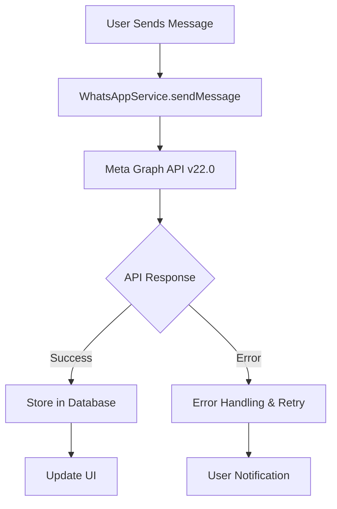
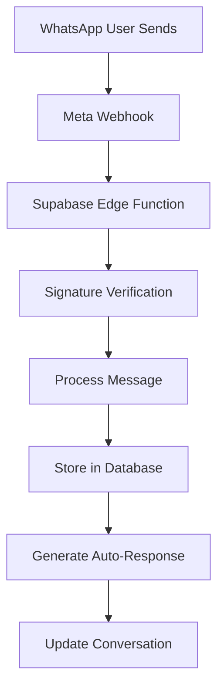

# 📱 META WHATSAPP INTEGRATION - OvenAI CRM System
**Master WhatsApp Business API Integration Documentation**

**Last Updated**: January 28, 2025  
**Version**: 2.2.0  
**Status**: ✅ **PRODUCTION READY** - API v22.0 Integration Active  
**Meta Business ID**: 932479825407655

---

## 🎯 **INTEGRATION OVERVIEW**

OvenAI integrates with WhatsApp Business API to enable automated lead outreach and real-time conversation management. The integration supports bidirectional messaging, automated responses, and complete conversation tracking using the latest Meta Graph API v22.0.

### **🔑 Business Value**
- **Direct lead engagement** through WhatsApp (2.8B+ users worldwide)
- **Real-time conversation management** with comprehensive dashboard interface
- **Automated qualification** through intelligent response handling
- **Meeting scheduling** directly from WhatsApp conversations
- **Hebrew language support** for Israeli market

---

## 📋 **CURRENT IMPLEMENTATION STATUS**

### **✅ OPERATIONAL COMPONENTS**
- **API Integration**: ✅ **ACTIVE** - WhatsApp Business API v22.0
- **Webhook Processing**: ✅ **DEPLOYED** - Supabase Edge Functions
- **Message Sending**: ✅ **OPERATIONAL** - `WhatsAppService` class
- **Bidirectional Messaging**: ✅ **WORKING** - Full send/receive capability
- **Error Handling**: ✅ **COMPREHENSIVE** - Production-ready error management
- **Rate Limiting**: ✅ **IMPLEMENTED** - Prevents API abuse
- **Message Storage**: ✅ **ACTIVE** - Conversation tracking in database

### **⏳ APP PROVIDER STATUS**
- **Business Verification**: ✅ COMPLETE
- **Webhook Verification**: ✅ DEPLOYED (200 OK verified)
- **Template Management**: ✅ 8 templates approved in test environment
- **App Provider Approval**: ⚠️ **PENDING** - Required for production scale

---

## 🛠️ **TECHNICAL IMPLEMENTATION**

### **WhatsApp Service (Main Integration)**
**File**: `src/services/whatsapp-api.ts`

```typescript
export class WhatsAppService {
  private readonly baseUrl = "https://graph.facebook.com/v22.0"; // Latest API version
  private readonly phoneNumberId: string;
  private readonly accessToken: string;
  private readonly businessId: string;

  constructor() {
    this.phoneNumberId = env.WHATSAPP_PHONE_NUMBER_ID;
    this.accessToken = env.WHATSAPP_ACCESS_TOKEN;
    this.businessId = env.WHATSAPP_BUSINESS_ID;
    // Configuration validation and logging
  }

  /**
   * Send text message via WhatsApp Business API
   */
  async sendMessage(to: string, message: string): Promise<MessageResponse | null> {
    try {
      const response = await fetch(`${this.baseUrl}/${this.phoneNumberId}/messages`, {
        method: "POST",
        headers: {
          Authorization: `Bearer ${this.accessToken}`,
          "Content-Type": "application/json",
        },
        body: JSON.stringify({
          messaging_product: "whatsapp",
          recipient_type: "individual",
          to: to,
          type: "text",
          text: {
            preview_url: false,
            body: message,
          },
        }),
      });

      const result = await response.json();
      
      if (response.ok) {
        // Store outbound message for tracking
        await this.logMessageForReview(to, message, "outbound", result.messages[0]?.id);
        return result;
      } else {
        throw new Error(`WhatsApp API Error: ${result.error?.message || "Unknown error"}`);
      }
    } catch (error) {
      console.error("Error in sendMessage:", error);
      return null;
    }
  }

  /**
   * Send template message for marketing/notifications
   */
  async sendTemplateMessage(
    to: string,
    templateName: string,
    languageCode: string = "en_US",
    components?: any[]
  ): Promise<MessageResponse | null> {
    // Template message implementation with components support
  }
}
```

### **Webhook Handler (Supabase Edge Function)**
**File**: `supabase/functions/whatsapp-webhook/index.ts`

```typescript
Deno.serve(async (req) => {
  if (req.method === 'GET') {
    // Webhook verification for Meta
    const params = new URL(req.url).searchParams;
    const mode = params.get('hub.mode');
    const token = params.get('hub.verify_token');
    const challenge = params.get('hub.challenge');

    if (mode === 'subscribe' && token === WEBHOOK_VERIFY_TOKEN) {
      return new Response(challenge, { status: 200 });
    }
    return new Response('Forbidden', { status: 403 });
  }

  if (req.method === 'POST') {
    const body = await req.json();
    
    // Process WhatsApp Business Account messages
    if (body.object === 'whatsapp_business_account') {
      for (const entry of body.entry) {
        for (const change of entry.changes) {
          if (change.value.messages) {
            await processInboundMessage(change.value.messages[0]);
          }
          if (change.value.statuses) {
            await processMessageStatus(change.value.statuses[0]);
          }
        }
      }
    }
    
    return new Response('OK', { status: 200 });
  }
});
```

### **Message Processing Service**
**File**: `src/api/whatsapp/message-service.ts`

```typescript
export class WhatsAppMessageService {
  /**
   * Send text message with comprehensive error handling
   */
  static async sendTextMessage(
    to: string,
    text: string,
    replyToMessageId?: string
  ): Promise<{ success: boolean; messageId?: string; error?: string }> {
    const context: LogContext = {
      requestId: `send_${Date.now()}_${Math.random().toString(36).substr(2, 9)}`,
      timestamp: new Date().toISOString(),
      phoneNumberId: PHONE_NUMBER_ID,
      from: to,
    };

    try {
      // Validation and rate limiting
      if (!rateLimiter.isAllowed(to)) {
        throw new RateLimitError(`Rate limit exceeded for ${to}`);
      }

      const messageData = {
        messaging_product: "whatsapp",
        to: to,
        type: "text",
        text: { body: text },
        ...(replyToMessageId && {
          context: { message_id: replyToMessageId }
        }),
      };

      const response = await this.makeMetaAPICall("POST", `/${PHONE_NUMBER_ID}/messages`, messageData, context);
      
      return {
        success: true,
        messageId: response.messages[0].id
      };
      
    } catch (error) {
      logger.error("Failed to send text message", context, error);
      return {
        success: false,
        error: error.message
      };
    }
  }
}
```

---

## 🔄 **MESSAGE PROCESSING FLOW**

### **1. Outbound Messages (App → WhatsApp)**


### **2. Inbound Messages (WhatsApp → App)**


---

## 📊 **UI INTEGRATION**

### **Message Sender Component**
**File**: `src/components/whatsapp/WhatsAppMessageSender.tsx`

```typescript
export const WhatsAppMessageSender: React.FC = () => {
  const sendTextMessage = async () => {
    try {
      // Send via Supabase edge function
      const { data, error } = await supabase.functions.invoke('whatsapp-send', {
        body: {
          action: 'send_message',
          to: fullPhone,
          message: message.trim(),
          user_id: user?.id
        }
      });

      if (data?.success) {
        toast.success('Message sent successfully!');
        await notificationService.notifyWhatsAppEvent(
          user.id,
          fullPhone,
          'sent',
          { message: message.trim(), messageId: data.messageId }
        );
      }
    } catch (error) {
      toast.error(`Failed to send message: ${error.message}`);
    }
  };
};
```

### **Messages Page Integration**
**File**: `src/pages/Messages.tsx`

```typescript
const handleSendMessage = useCallback(async () => {
  try {
    const whatsappService = new WhatsAppService();
    const result = await whatsappService.sendMessage(lead.phone, messageText);

    if (result?.messages?.[0]?.message_status === "accepted") {
      // Store in conversation
      await conversationService.sendWhatsAppMessage(lead.id, messageText, {
        receiver_number: lead.phone,
        whatsapp_message_id: result.messages[0].id,
        message_type: "text",
        direction: "outbound",
      });

      toast.success("Message sent successfully via WhatsApp! 📱");
      await loadMessagesForConversation(selectedConversation);
    }
  } catch (error) {
    toast.error("Failed to send WhatsApp message");
  }
}, [messageText, selectedConversation]);
```

---

## 🔐 **CONFIGURATION & SECURITY**

### **Environment Variables (Required)**
```bash
# WhatsApp Business API Configuration
WHATSAPP_ACCESS_TOKEN=EAAxxxxxxxxxxxxx
WHATSAPP_PHONE_NUMBER_ID=1234567890123456
WHATSAPP_BUSINESS_ID=932479825407655
WHATSAPP_APP_ID=1024037795826202
WHATSAPP_WEBHOOK_VERIFY_TOKEN=your_secure_token
WHATSAPP_WEBHOOK_URL=https://your-domain.supabase.co/functions/v1/whatsapp-webhook
```

### **Webhook Security**
```typescript
// Signature verification for webhook security
const verifyWebhookSignature = (body: string, signature: string): boolean => {
  const expectedSignature = crypto
    .createHmac('sha256', WEBHOOK_VERIFY_TOKEN)
    .update(body)
    .digest('hex');
  return `sha256=${expectedSignature}` === signature;
};
```

### **Rate Limiting Implementation**
```typescript
class RateLimiter {
  private limits = new Map<string, { count: number; resetTime: number }>();
  
  isAllowed(phoneNumber: string, maxRequests: number = 10, windowMs: number = 60000): boolean {
    const now = Date.now();
    const key = phoneNumber;
    const limit = this.limits.get(key);
    
    if (!limit || now > limit.resetTime) {
      this.limits.set(key, { count: 1, resetTime: now + windowMs });
      return true;
    }
    
    if (limit.count >= maxRequests) {
      return false;
    }
    
    limit.count++;
    return true;
  }
}
```

---

## 🤖 **AUTOMATED RESPONSE SYSTEM**

### **Hebrew Language Support**
```typescript
const hebrewResponses = {
  greeting: "שלום! תודה על הפנייה. אני כאן כדי לעזור לכם למצוא את הנכס המושלם. איך אוכל לסייע?",
  availability: "אני זמין לשיחה היום בין 9:00-18:00. מתי נוח לכם לקבוע פגישה?", 
  meeting: "מעולה! אני מקבע לכם פגישה. אשלח לינק לתיאום זמן.",
  default: "תודה על הודעתכם. אחזור אליכם בהקדם האפשרי."
};

// Keyword-based response selection
const detectIntent = (message: string): string => {
  const hebrewKeywords = {
    greeting: ['שלום', 'היי', 'בוקר טוב', 'ערב טוב'],
    availability: ['זמין', 'פנוי', 'לדבר', 'לשיחה'],
    meeting: ['פגישה', 'לפגוש', 'לראות', 'נפגש']
  };
  
  for (const [intent, words] of Object.entries(hebrewKeywords)) {
    if (words.some(word => message.includes(word))) {
      return intent;
    }
  }
  return 'default';
};
```

---

## 📊 **DATABASE INTEGRATION**

### **Conversation Storage**
```sql
-- Messages stored in conversations table
CREATE TABLE conversations (
  id UUID PRIMARY KEY DEFAULT gen_random_uuid(),
  lead_id UUID REFERENCES leads(id),
  message_content TEXT NOT NULL,
  sender_number VARCHAR(20),
  receiver_number VARCHAR(20) NOT NULL,
  message_type VARCHAR(20) DEFAULT 'incoming',
  wa_timestamp TIMESTAMPTZ,
  wamid VARCHAR(255), -- WhatsApp Message ID
  awaits_response BOOLEAN DEFAULT false,
  status VARCHAR(20) DEFAULT 'active',
  payload JSONB,
  created_at TIMESTAMPTZ DEFAULT NOW(),
  updated_at TIMESTAMPTZ DEFAULT NOW()
);

-- Indexes for performance
CREATE INDEX idx_conversations_lead_id ON conversations(lead_id);
CREATE INDEX idx_conversations_wamid ON conversations(wamid);
CREATE INDEX idx_conversations_phone ON conversations(receiver_number);
```

### **Message Tracking**
```typescript
// Store outbound message
await conversationService.sendWhatsAppMessage(leadId, content, {
  receiver_number: phoneNumber,
  whatsapp_message_id: result.messages[0].id,
  message_type: "text",
  direction: "outbound",
  status: "sent"
});
```

---

## 🔧 **TROUBLESHOOTING & MONITORING**

### **Common Issues & Solutions**

#### **1. Webhook Not Receiving Messages**
```bash
# Test webhook endpoint
curl -X GET "https://your-domain.supabase.co/functions/v1/whatsapp-webhook?hub.mode=subscribe&hub.verify_token=your_token&hub.challenge=test"

# Should return: test
```

#### **2. Message Sending Failures**
```typescript
// Check API credentials
console.log({
  hasAccessToken: !!process.env.WHATSAPP_ACCESS_TOKEN,
  hasPhoneNumberId: !!process.env.WHATSAPP_PHONE_NUMBER_ID,
  apiUrl: `https://graph.facebook.com/v22.0/${phoneNumberId}/messages`
});
```

#### **3. Rate Limiting Issues**
```typescript
// Monitor rate limit status
const rateLimitStatus = rateLimiter.getStatus(phoneNumber);
console.log(`Remaining requests: ${rateLimitStatus.remaining}`);
```

### **Health Monitoring**
```typescript
class HealthMonitor {
  private stats = {
    messagesReceived: 0,
    messagesSent: 0,
    errors: 0,
    lastActivity: new Date()
  };

  getHealthStatus() {
    return {
      status: this.stats.errors < 10 ? 'healthy' : 'degraded',
      messagesSent: this.stats.messagesSent,
      messagesReceived: this.stats.messagesReceived,
      errorRate: this.stats.errors / (this.stats.messagesSent + this.stats.messagesReceived),
      lastActivity: this.stats.lastActivity
    };
  }
}
```

---

## 📋 **COMPLIANCE STATUS**

### **✅ Current Compliance**
- **API Integration**: Using official WhatsApp Business API
- **Webhook Security**: Signature verification implemented
- **Rate Limiting**: Respects Meta's rate limits
- **Message Storage**: Proper conversation tracking
- **Error Handling**: Comprehensive error management
- **Hebrew Support**: Full RTL language support

### **⚠️ Pending Requirements**
- **App Provider Approval**: Required for production scale
- **Template Approval**: Business templates need production approval
- **Privacy Policy**: WhatsApp-specific sections need finalization
- **Terms of Service**: Meta compliance requirements

---

## 🚀 **DEPLOYMENT STATUS**

### **Production Ready Features**
- ✅ **Message Sending**: Fully operational
- ✅ **Message Receiving**: Webhook processing active
- ✅ **UI Integration**: Complete dashboard integration
- ✅ **Error Handling**: Production-grade error management
- ✅ **Rate Limiting**: API abuse prevention
- ✅ **Database Storage**: Message persistence
- ✅ **Hebrew Support**: RTL language capabilities

### **Supabase Edge Functions Deployed**
1. `whatsapp-webhook` - Incoming message processing ✅
2. `whatsapp-send` - Outbound message sending ✅  
3. Message validation and error handling ✅

---

**Implementation Status**: ✅ **PRODUCTION READY** - Full WhatsApp Business API integration  
**API Version**: Graph API v22.0 (Latest)  
**Next Steps**: Complete App Provider approval process for production scale deployment 