# Mermaid Diagrams

## 1. `public` Schema from `full_backup.sql` - Core Tables & Relations

[Link back to Section 8.1.6 in schema migration.md](./schema%20migration.md#816-mermaid-diagram-for-fullbackupsql-public-schema---core-tables--relations)

```mermaid
erDiagram
    clients {
        uuid id PK
        text name UK
        text email UK
        text phone_number
        jsonb contact_info
        text api_key UK
        uuid primary_contact_user_id FK "auth.users.id"
        text whatsapp_phone_number
        numeric whatsapp_number_id
        client_status_enum status
        timestamptz created_at
        timestamptz updated_at
    }

    projects {
        uuid id PK
        uuid client_id FK "clients.id"
        text name
        project_status_enum status
        uuid created_by_user_id FK "auth.users.id"
        timestamptz created_at
        timestamptz updated_at
    }

    leads {
        uuid id PK
        uuid client_id FK "clients.id"
        uuid project_id FK "projects.id"
        text external_id
        lead_status_enum status
        lead_state_enum state
        jsonb lead_data
        uuid assigned_to_user_id FK "auth.users.id"
        uuid pipeline_id FK "deal_pipelines.id"
        uuid deal_stage_id FK "deal_stages.id"
        uuid active_thread_id FK "threads.id"
        timestamptz created_at
        timestamptz updated_at
    }

    conversations {
        uuid id PK
        uuid lead_id FK "leads.id"
        uuid client_id FK "clients.id"
        text channel
        conversation_status_enum status
        uuid assigned_agent_id FK "auth.users.id"
        timestamptz start_time
        timestamptz last_message_at
    }

    messages {
        uuid id PK
        uuid conversation_id FK "conversations.id"
        uuid client_id FK "clients.id"
        uuid lead_id FK "leads.id"
        text sender_id
        text sender_type
        text content_body
        message_status_enum status
        text external_message_id
        message_direction_enum direction
        timestamptz timestamp
    }

    threads {
        uuid id PK
        uuid lead_id FK "leads.id"
        uuid client_id FK "clients.id"
        uuid project_id FK "projects.id"
        conversation_status_enum status "Reusing conversation_status_enum"
        timestamptz created_at
        timestamptz updated_at
    }
    
    user_profiles {
        uuid user_id PK "auth.users.id"
        uuid client_id PK "clients.id"
        text full_name
        text role "Role within client"
        user_profile_status_enum status
        timestamptz created_at
    }

    notifications {
        uuid id PK
        uuid user_id FK "auth.users.id"
        uuid client_id FK "clients.id"
        text type
        text title
        boolean is_read
        timestamptz created_at
    }

    deal_pipelines {
        uuid id PK
        uuid client_id FK "clients.id"
        text name
        boolean is_default
        uuid created_by_user_id FK "auth.users.id"
        timestamptz created_at
    }

    deal_stages {
        uuid id PK
        uuid pipeline_id FK "deal_pipelines.id"
        uuid client_id FK "clients.id"
        text name
        integer stage_order
        numeric probability
        uuid created_by_user_id FK "auth.users.id"
        timestamptz created_at
    }
    
    n8n_workflows {
        uuid id PK
        uuid client_id FK "clients.id"
        text name
        text n8n_workflow_id UK
        workflow_status_enum status
        jsonb definition_json
        uuid created_by_user_id FK "auth.users.id"
        timestamptz created_at
    }

    n8n_executions {
        uuid id PK
        uuid workflow_db_id FK "n8n_workflows.id"
        uuid client_id FK "clients.id"
        text n8n_execution_id UK
        execution_status_enum status
        timestamptz started_at
        jsonb input_data
        jsonb output_data
    }

    ai_models {
        uuid id PK
        text name UK
        text provider
        text model_identifier
        model_status_enum status
        timestamptz created_at
    }
    
    ai_prompts {
        uuid id PK
        uuid client_id FK "clients.id"
        text name
        text prompt_text
        uuid model_id FK "ai_models.id"
        prompt_status_enum status
        uuid created_by_user_id FK "auth.users.id"
        timestamptz created_at
        UNIQUE client_id name version
    }

    ai_interactions {
        uuid id PK
        uuid client_id FK "clients.id"
        uuid lead_id FK "leads.id"
        uuid conversation_id FK "conversations.id"
        uuid message_id FK "messages.id"
        uuid prompt_id FK "ai_prompts.id"
        uuid model_id FK "ai_models.id"
        interaction_status_enum status
        jsonb input_data
        jsonb output_data
        timestamptz timestamp
    }

    "auth.users" ||--o{ clients : "primary_contact_for"
    "auth.users" ||--o{ projects : "created_by"
    "auth.users" ||--o{ leads : "assigned_to"
    "auth.users" ||--o{ conversations : "assigned_agent_is"
    "auth.users" ||--o{ user_profiles : "has_profile_for_client"
    "auth.users" ||--o{ notifications : "receives"
    "auth.users" ||--o{ deal_pipelines : "created_by"
    "auth.users" ||--o{ deal_stages : "created_by"
    "auth.users" ||--o{ n8n_workflows : "created_by"
    "auth.users" ||--o{ ai_prompts : "created_by"
    "auth.users" ||--o{ tasks : "assigned_to_or_created_by"
    "auth.users" ||--o{ audit_logs : "performed_by_or_impersonated"


    clients ||--o{ projects : "has"
    clients ||--o{ leads : "has"
    clients ||--o{ conversations : "context_for"
    clients ||--o{ messages : "context_for"
    clients ||--o{ threads : "context_for"
    clients ||--o{ user_profiles : "scopes"
    clients ||--o{ notifications : "context_for"
    clients ||--o{ deal_pipelines : "owns"
    clients ||--o{ deal_stages : "owns_via_pipeline"
    clients ||--o{ n8n_workflows : "owns"
    clients ||--o{ n8n_executions : "owns_via_workflow"
    clients ||--o{ ai_prompts : "can_scope"
    clients ||--o{ ai_interactions : "context_for"
    clients ||--o{ tasks : "context_for"
    clients ||--o{ audit_logs : "context_for"
    clients ||--o{ knowledge_base_articles : "owns"
    clients ||--o{ integrations : "configures"
    clients ||--o{ webhook_events : "receives_for"
    clients ||--o{ data_exports : "owns"
    
    projects ||--o{ leads : "can_contain"
    projects ||--o{ threads : "can_contain"

    leads ||--o{ conversations : "has"
    leads ||--o{ messages : "related_to_via_conversation"
    leads ||--o{ threads : "can_have_active"
    leads ||--o{ ai_interactions : "can_trigger"
    leads ||--o{ lead_status_history : "tracks_status_for"
    leads ||--o{ lead_journey_events : "triggers_for"
    leads ||--o{ tasks : "can_be_related_to"

    threads ||--o{ messages : "contains" "Conceptually, messages are part of a thread/conversation"
    conversations ||--o{ messages : "contains"

    deal_pipelines ||--o{ deal_stages : "contains_stages"
    deal_pipelines ||--o{ leads : "categorizes"

    n8n_workflows ||--o{ n8n_executions : "has_executions"
    
    ai_models ||--o{ ai_prompts : "used_by"
    ai_models ||--o{ ai_interactions : "powers"
    ai_prompts ||--o{ ai_interactions : "instance_of"

``` 

