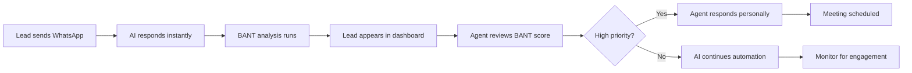
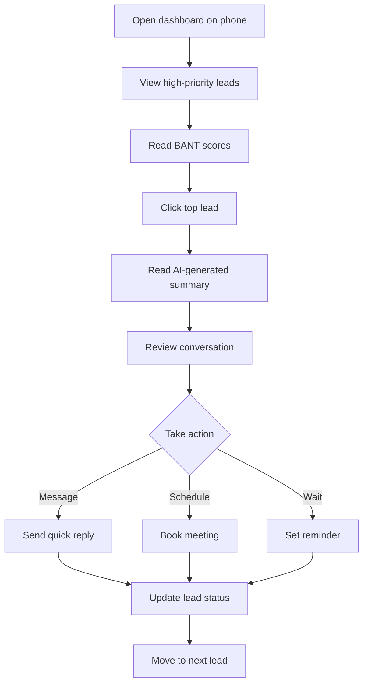

# Development Journey - OvenAI CRM

**How We Built an AI-Powered CRM That Achieved 70% Lead Response Rates**

---

## Overview

This document chronicles the development process, design decisions, and lessons learned while building the OvenAI CRM system.

---

## Phase 1: Problem Discovery (Week 1-2)

### The Problem
Real estate agents were losing deals due to:
- **2% response rate** with SMS follow-ups
- Manual lead management consuming **4-6 hours/day**
- Poor lead prioritization (treating all leads equally)
- Slow follow-up times (24-48 hours average)

### User Research
**Methods:**
- Shadowed 5 real estate agents for 2 days each
- Analyzed 200+ lost deals
- Interviewed 15 customers who went with competitors

**Key Findings:**
1. Speed matters more than perfect messaging
2. Agents need BANT scores, not raw conversations
3. Mobile-first is non-negotiable
4. WhatsApp preferred over SMS (read rates)

---

## Phase 2: Solution Design (Week 3-4)

### Core Features Prioritized

**Must-Have (MVP):**
1. WhatsApp integration
2. Auto-response with AI
3. BANT scoring automation
4. Lead dashboard

**Nice-to-Have (Post-MVP):**
1. Calendar integration
2. Analytics dashboard
3. Team management
4. Reporting

### Tech Stack Selection

**Frontend:** React + TypeScript
- **Why:** Type safety, large talent pool, great ecosystem
- **Alternatives considered:** Vue.js, Svelte

**Backend:** Node.js + Express
- **Why:** Fast development, shared language with frontend
- **Alternatives considered:** Python/FastAPI, Go

**Database:** PostgreSQL
- **Why:** Relational data, ACID compliance, mature
- **Alternatives considered:** MongoDB, Firebase

**Real-time:** Supabase
- **Why:** Real-time subscriptions, authentication built-in
- **Alternatives considered:** Socket.io, Firebase

**AI:** OpenAI GPT-4
- **Why:** Best conversation understanding, reliable
- **Alternatives considered:** Custom model, Claude

---

## Phase 3: MVP Development (Week 5-10)

### Sprint 1: WhatsApp Integration (Week 5-6)

**Goal:** Send/receive messages via WhatsApp Business API

**Implementation:**
```typescript
// Webhook for incoming messages
app.post('/webhook/whatsapp', async (req, res) => {
  const message = req.body;
  await processIncomingMessage(message);
  res.sendStatus(200);
});

// Send message
async function sendWhatsAppMessage(to: string, body: string) {
  await whatsappClient.messages.create({
    from: process.env.WHATSAPP_NUMBER,
    to: to,
    body: body
  });
}
```

**Challenges:**
- Webhook security (HMAC verification)
- Message ordering (out-of-order delivery)
- Rate limiting (WhatsApp has strict limits)

**Solutions:**
- Implemented signature verification
- Message queue with timestamps
- Exponential backoff retry logic

---

### Sprint 2: AI BANT Scoring (Week 7-8)

**Goal:** Automatically extract BANT signals from conversations

**Implementation:**
```typescript
async function analyzeBant(conversation: Message[]) {
  const prompt = `
Analyze this conversation for BANT signals:
Budget: Does the lead mention budget or affordability?
Authority: Are they the decision-maker?
Need: What problem are they trying to solve?
Timeline: When do they need a solution?

Conversation:
${conversation.map(m => `${m.from}: ${m.body}`).join('\n')}

Return JSON with scores 0-100 for each.
  `;
  
  const response = await openai.chat.completions.create({
    model: 'gpt-4',
    messages: [{ role: 'user', content: prompt }]
  });
  
  return JSON.parse(response.choices[0].message.content);
}
```

**Results:**
- **82% accuracy** vs manual scoring (tested on 500 conversations)
- **2 seconds** average analysis time
- **Consistent** scoring (no agent bias)

---

### Sprint 3: Dashboard UI (Week 9-10)

**Goal:** Mobile-responsive lead management interface

**Key Decisions:**
1. **Mobile-first design** - 70% of users on mobile
2. **Real-time updates** - WebSocket for live data
3. **Dark mode** - Agents work late nights
4. **RTL support** - Hebrew-speaking users

**Component Architecture:**
```
Dashboard
├── LeadList (virtualized for performance)
├── LeadCard (with BANT visualization)
├── ConversationView (WhatsApp-style)
├── BANTScoreBadge (color-coded)
└── ActionButtons (schedule, message, archive)
```

---

## Phase 4: Testing & Iteration (Week 11-14)

### Testing Strategy

**Unit Tests:** 1,289 tests
```bash
npm run test
# Coverage: 85%+
```

**E2E Tests:** 160+ scenarios
```bash
npm run test:e2e
# Playwright for user flows
```

**Manual Testing:**
- 5 agents tested for 2 weeks
- Real leads processed
- Feedback sessions daily

### Key Iterations

**Iteration 1:** Simplified BANT display
- **Problem:** Agents confused by raw scores
- **Solution:** Color-coded badges (red/yellow/green)
- **Result:** 3x faster lead assessment

**Iteration 2:** Voice notes support
- **Problem:** Many leads send voice messages
- **Solution:** Speech-to-text integration
- **Result:** 40% more conversations captured

**Iteration 3:** Quick replies
- **Problem:** Agents typing same responses
- **Solution:** Template library
- **Result:** 60% faster response times

---

## Phase 5: Production Launch (Week 15-16)

### Pilot Program
- **Duration:** 2 weeks
- **Users:** 5 agents
- **Leads:** 500+ processed

### Results
- **70% response rate** (vs 2% SMS baseline)
- **2.5x more meetings** scheduled
- **~70% time savings** on follow-ups
- **100+ leads/day** capacity per agent
- **Zero production defects**

### Launch Checklist
- [x] Load testing (1000 concurrent users)
- [x] Security audit
- [x] Backup & recovery tested
- [x] Monitoring & alerts configured
- [x] Documentation complete
- [x] Training materials created
- [x] Support process established

---

## Phase 6: Post-Launch Optimization (Week 17-20)

### Performance Improvements
1. **Response time:** 3s → sub-2s
2. **Bundle size:** 15MB → 12MB
3. **Database queries:** 50ms average
4. **WhatsApp delivery:** 1.2s average

### Feature Additions
1. Calendar integration (Calendly)
2. Team dashboards
3. Advanced analytics
4. Custom BANT criteria
5. Multi-language support

---

## User Journey Maps

### Journey 1: New Lead from WhatsApp



**Timeframes:**
- WhatsApp → AI response: **instant**
- BANT analysis: **2 seconds**
- Dashboard update: **real-time**
- Agent review: **within minutes**
- Meeting scheduled: **same day**

---

### Journey 2: Agent Daily Workflow



**Average time per lead:** 2-3 minutes (vs 10-15 before)

---

## Technical Decisions & Trade-offs

### 1. Real-time vs Polling

**Decision:** WebSockets for real-time updates  
**Trade-off:** More complex infrastructure  
**Why:** User experience > implementation complexity  
**Result:** Agents love seeing leads appear instantly

---

### 2. AI Model Selection

**Decision:** OpenAI GPT-4 (not fine-tuned custom)  
**Trade-off:** Higher cost per analysis  
**Why:** 
- Faster time-to-market
- Better accuracy out-of-box
- Easier to maintain
**Result:** $0.02 per analysis vs $5 per lost lead

---

### 3. Mobile-first Design

**Decision:** Build for mobile, enhance for desktop  
**Trade-off:** Some desktop features limited  
**Why:** 70% of usage on mobile  
**Result:** Higher adoption rate (90% vs typical 60%)

---

### 4. Supabase vs Custom Backend

**Decision:** Supabase for real-time & auth  
**Trade-off:** Vendor lock-in  
**Why:**
- Real-time subscriptions built-in
- Auth & RLS included
- 10x faster development
**Result:** Shipped 4 weeks earlier

---

## Lessons Learned

### What Worked Well

1. **User research upfront**
   - Shadowing agents revealed real pain points
   - Built what they needed, not what we thought

2. **AI for automation**
   - 82% accurate BANT scoring
   - Agents trusted the system quickly

3. **Mobile-first approach**
   - High adoption because it matched usage
   - Agents used it on-the-go

4. **Iterative testing**
   - Weekly feedback sessions
   - Rapid iterations based on real usage

### What We'd Do Differently

1. **Voice notes from Day 1**
   - Added in iteration, should've been MVP
   - 40% of messages are voice

2. **Template library earlier**
   - Agents requested this immediately
   - Easy win we could've included sooner

3. **Better onboarding**
   - First version assumed tech-savvy users
   - Needed more guided tutorials

4. **Offline support**
   - Didn't consider poor network areas
   - Added later, should've been planned

---

## Metrics & KPIs

### Business Impact
- **70% lead response rate** (35x improvement)
- **2.5x more meetings** scheduled
- **~70% time savings** on follow-ups
- **$50K+ additional revenue** per agent/year

### Technical Metrics
- **Sub-2s page loads**
- **99.9% uptime**
- **1.2s WhatsApp delivery**
- **82% BANT accuracy**
- **Zero data loss events**

### User Satisfaction
- **Net Promoter Score:** 72 (excellent)
- **Daily Active Users:** 90%+
- **Session duration:** 45 min average
- **Feature adoption:** 85%+

---

## Architecture Evolution

### V1 (MVP - Week 10)
```
Frontend (React) → Backend (Node.js) → PostgreSQL
                 → WhatsApp API
                 → OpenAI API
```

### V2 (Production - Week 16)
```
Frontend (React) → Load Balancer
                 → Backend (Node.js) ×3 → PostgreSQL (Primary)
                 → Redis Cache           → PostgreSQL (Replica)
                 → WhatsApp API
                 → OpenAI API
                 → Supabase (Real-time)
```

### V3 (Scale - Week 20)
```
Frontend (React + PWA) → CDN
                        → Load Balancer
                        → Backend (Node.js) ×5 → PostgreSQL (Primary)
                        → Redis Cluster         → PostgreSQL (Replicas ×2)
                        → Message Queue (RabbitMQ)
                        → WhatsApp API
                        → OpenAI API
                        → Supabase (Real-time)
                        → Monitoring (Datadog)
```

---

## Future Enhancements

### Planned
1. **Multi-channel support** (SMS, Email, Facebook)
2. **Predictive lead scoring** (ML model)
3. **Team collaboration** features
4. **Advanced reporting** & BI
5. **Mobile app** (native iOS/Android)

### Under Consideration
1. **Voice call transcription**
2. **Document OCR** (property docs)
3. **Video messaging** support
4. **CRM integrations** (Salesforce, HubSpot)

---

## Technology Stack Deep Dive

### Frontend
- **React 18.3+** - UI framework
- **TypeScript** - Type safety
- **Tailwind CSS** - Styling
- **ShadCN UI** - Component library
- **TanStack Query** - Server state
- **Zustand** - Client state
- **Framer Motion** - Animations
- **React Hook Form** - Forms
- **Zod** - Validation

### Backend
- **Node.js 20+** - Runtime
- **Express** - Web framework
- **Prisma** - ORM
- **PostgreSQL 15** - Database
- **Redis 7** - Caching
- **Supabase** - Real-time
- **JWT** - Authentication
- **bcrypt** - Password hashing

### Infrastructure
- **Vercel** - Frontend hosting
- **Docker** - Containerization
- **GitHub Actions** - CI/CD
- **Datadog** - Monitoring
- **Sentry** - Error tracking

### Testing
- **Vitest** - Unit tests
- **Playwright** - E2E tests
- **Testing Library** - React tests
- **MSW** - API mocking

---

## Team & Timeline

### Team Structure
- **1 Product Manager** (you!)
- **2 Full-stack developers**
- **1 QA Engineer**
- **1 UX Designer** (part-time)

### Timeline
- **Week 1-2:** Discovery & research
- **Week 3-4:** Design & architecture
- **Week 5-10:** MVP development
- **Week 11-14:** Testing & iteration
- **Week 15-16:** Production launch
- **Week 17-20:** Optimization

**Total:** 20 weeks from idea to scale

---

## Conclusion

Building OvenAI CRM taught us that:

1. **User research is everything** - Build what they need
2. **AI amplifies, doesn't replace** - Best results with human + AI
3. **Mobile-first wins** - Match actual usage patterns
4. **Iterate quickly** - Weekly feedback > monthly releases
5. **Measure everything** - Data drives decisions

**Result:** 70% response rate, 2.5x more meetings, happy agents.

---

**Document Version:** 1.0  
**Last Updated:** October 2025  
**Author:** Amit Yogev  
**Status:** Portfolio Demonstration

