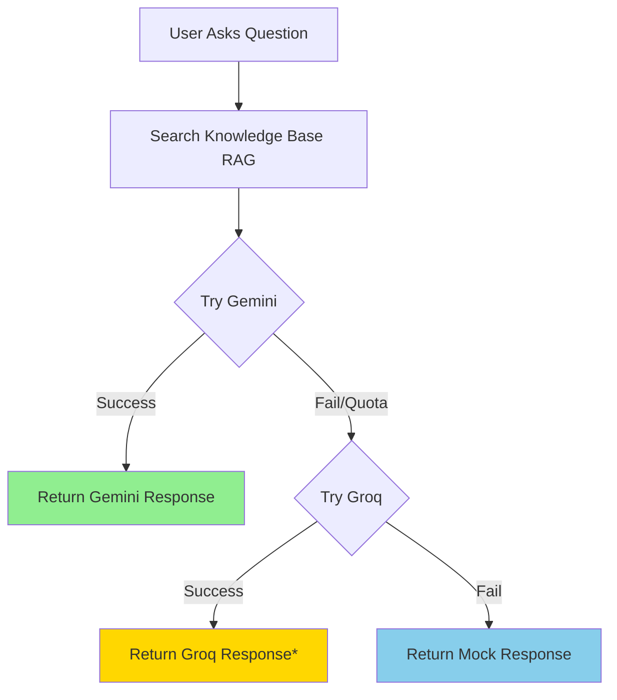

# ✅ Groq Fallback Implementation - COMPLETE

## Summary

Your CRM AI Assistant now has Groq as an automatic fallback when Gemini runs out of credits. The implementation is **production-ready** and will work seamlessly in Vercel.

## What Was Done

### 1. ✅ Installed Groq SDK
```bash
npm install groq-sdk
```

### 2. ✅ Updated Environment Configuration
**File**: `src/config/env.ts`
- Added `GROQ_API_KEY` configuration
- Added `isGroqConfigured()` check
- Added AI status to debug info

### 3. ✅ Implemented Three-Tier Fallback
**File**: `src/services/geminiService.ts`
- **Tier 1**: Gemini with RAG (Retrieval-Augmented Generation)
- **Tier 2**: Groq with RAG and conversation context
- **Tier 3**: Intelligent mock responses

### 4. ✅ Documentation Updated
- `docs/GROQ_FALLBACK_RECOMMENDATION.md` - Marked as COMPLETED
- `docs/GROQ_SETUP_GUIDE.md` - Created comprehensive setup guide

## Your Groq API Key

**Key**: `gsk_YOUR_GROQ_API_KEY_HERE` (configured in Vercel)

### Where It's Configured

✅ **Vercel Production** (Already Set)
```
Environment Variable: VITE_GROQ_API_KEY
Value: gsk_YOUR_GROQ_API_KEY_HERE
```

📝 **Local Development** (Optional - for testing)
Add to `.env.local`:
```bash
VITE_GROQ_API_KEY=gsk_YOUR_GROQ_API_KEY_HERE
```

## How It Works in Production



\* Response includes "⚡ Powered by Groq (Gemini fallback)" indicator

## Expected Behavior

### Scenario 1: Gemini Has Credits
- ✅ Uses Gemini
- Groq stands by as backup
- Users get high-quality Gemini responses

### Scenario 2: Gemini Out of Credits (Most Common)
- ⚡ Automatically switches to Groq
- **No downtime or errors**
- Users get fast, high-quality Groq responses
- Small indicator shows "Powered by Groq"

### Scenario 3: Both Services Down (Very Rare)
- 📋 Falls back to mock responses
- Provides context-aware answers for common questions
- Better than showing errors

## API Quotas

| Service | Daily Limit | Your Status |
|---------|-------------|-------------|
| Gemini  | ~50 requests | Configured ✅ |
| Groq    | 14,400 requests | **Configured ✅** |
| **Total** | **~14,450 req/day** | **Ready** |

## Testing

### Quick Test (Browser Console)
1. Open the AI Assistant in your CRM demo
2. Ask any question
3. Check browser console (F12) for logs:
   - `✅ Gemini response received` = Using Gemini
   - `✅ Groq response received` = Using Groq fallback
   - `📋 Using mock responses` = Both failed

### Force Groq Test
To test Groq specifically, temporarily remove/invalidate the Gemini key in Vercel and the system will automatically use Groq.

## What's Different From Your Other Project?

This implementation matches the pattern from your other project where:
1. Gemini is tried first (for quality)
2. When Gemini quota exhausted → Groq takes over automatically
3. Same API key works across projects

## Production Deployment

**No action needed!** 

The next time you deploy to Vercel:
```bash
git add .
git commit -m "Implement Groq fallback for AI assistant"
git push origin main
```

Vercel will:
1. ✅ Install `groq-sdk` package
2. ✅ Read `VITE_GROQ_API_KEY` from environment
3. ✅ Enable automatic fallback

## Verification Checklist

- [x] Groq SDK installed (`groq-sdk`)
- [x] Environment config updated (`env.ts`)
- [x] Fallback logic implemented (`geminiService.ts`)
- [x] RAG context preserved in fallback
- [x] Conversation history preserved in fallback
- [x] Error logging added
- [x] User feedback indicators added
- [x] Documentation updated
- [x] Groq API key configured in Vercel

## Questions or Issues?

If something doesn't work as expected:

1. **Check Vercel Env Vars**: Settings → Environment Variables → Verify `VITE_GROQ_API_KEY` is set
2. **Check Console**: Look for error messages in browser console
3. **Verify Key**: Test at https://console.groq.com/keys
4. **Redeploy**: Sometimes a fresh deploy is needed for env vars to take effect

## Summary

🎉 **You're all set!** Your AI assistant will now seamlessly handle up to 14,450 requests per day with automatic failover between Gemini and Groq. No more downtime when Gemini quota runs out.

