# 🚀 WhatsApp Conversation Flow - Complete Architecture Analysis

**Date**: January 29, 2025  
**Purpose**: Clarify end-to-end message flow from UI → WhatsApp → Database sync  
**Architecture**: Site DB (UI) ↔ Agent DB (Master) ↔ WhatsApp Business API  

---

## 🎯 **YOUR ARCHITECTURAL CONCERNS - ANSWERED**

### **Key Questions Resolved:**
1. ✅ **How does the end user (lead) see new messages?** → Direct WhatsApp delivery
2. ✅ **How is SiteDB updated?** → Edge functions store immediately after WhatsApp send
3. ✅ **How is AgentDB updated?** → Automated sync triggers from SiteDB
4. ✅ **Do we send first or update first?** → Send to WhatsApp FIRST, then store in databases
5. ✅ **What's the correct flow order?** → See detailed flow below

---

## 📊 **COMPLETE MESSAGE FLOW ARCHITECTURE**

### **🔄 OUTBOUND MESSAGE FLOW** (User sends to Lead)

```mermaid
sequenceDiagram
    participant UI as Web UI
    participant EdgeFn as Edge Function
    participant WhatsApp as WhatsApp API
    participant SiteDB as Site DB (UI)
    participant AgentDB as Agent DB (Master)
    participant Lead as Lead's Phone

    UI->>EdgeFn: 1. supabase.functions.invoke('whatsapp-send')
    EdgeFn->>WhatsApp: 2. POST to Facebook Graph API
    WhatsApp->>Lead: 3. 📱 LEAD RECEIVES MESSAGE
    WhatsApp-->>EdgeFn: 4. Message ID & delivery status
    EdgeFn->>SiteDB: 5. Store in whatsapp_messages table
    EdgeFn->>SiteDB: 6. Update conversations table
    SiteDB->>AgentDB: 7. 🔄 Auto-sync via triggers
    EdgeFn-->>UI: 8. Success response
```



### **📥 INBOUND MESSAGE FLOW** (Lead replies to User)

```mermaid
sequenceDiagram
    participant Lead as Lead's Phone
    participant WhatsApp as WhatsApp API  
    participant Webhook as Webhook Function
    participant SiteDB as Site DB (UI)
    participant AgentDB as Agent DB (Master)
    participant UI as Web UI

    Lead->>WhatsApp: 1. 📱 LEAD SENDS MESSAGE
    WhatsApp->>Webhook: 2. POST webhook notification
    Webhook->>SiteDB: 3. Store in whatsapp_messages
    Webhook->>SiteDB: 4. Update conversations table
    Webhook->>SiteDB: 5. Generate auto-response (if enabled)
    SiteDB->>AgentDB: 6. 🔄 Auto-sync via triggers
    SiteDB->>UI: 7. Real-time notification
```



---

## 💡 **CRITICAL INSIGHT: WHATSAPP DELIVERY FIRST**

### **✅ CORRECT ORDER:**
1. **WhatsApp API Call** → Lead receives message on their phone **IMMEDIATELY**
2. **Database Storage** → Store success/failure in SiteDB
3. **Cross-DB Sync** → Replicate to AgentDB
4. **UI Notification** → Show success to user

### **❌ COMMON MISCONCEPTION:**
- Databases are **NOT** involved in actual WhatsApp delivery
- Databases **ONLY** store conversation history and sync state
- The **Edge Function** handles both WhatsApp API AND database storage

---

## 🗄️ **DATABASE ROLES CLARIFIED**

### **Site DB (ajszzemkpenbfnghqiyz) - UI Database**
| Table | Purpose | When Updated |
|-------|---------|--------------|
| `whatsapp_messages` | Message history | After WhatsApp API call |
| `conversations` | Conversation threads | After WhatsApp API call |
| `leads` | Lead status updates | When message sent/received |
| `notifications` | UI notifications | After database storage |

### **Agent DB (imnyrhjdoaccxenxyfam) - Master Database**  
| Table | Purpose | When Updated |
|-------|---------|--------------|
| `whatsapp_messages` | Master message log | Auto-sync from SiteDB |
| `conversations` | Master conversation data | Auto-sync from SiteDB |
| `leads` | Master lead records | Auto-sync from SiteDB |
| `agent_processing_log` | N8N automation context | During automation |

---

## 🔧 **DETAILED TECHNICAL FLOW**

### **1. User Clicks "Send Message" in UI**
```typescript
// src/components/whatsapp/WhatsAppMessageSender.tsx
const sendTextMessage = async () => {
  // Step 1: Call edge function (NOT direct database)
  const { data, error } = await supabase.functions.invoke('whatsapp-send', {
    body: {
      action: 'send_message',
      to: fullPhone,
      message: message.trim(),
      user_id: user?.id
    }
  });
}
```

### **2. Edge Function Sends to WhatsApp API**
```typescript
// supabase/functions/whatsapp-send/index.ts
async function sendWhatsAppMessage({ to, message, accessToken, phoneNumberId }) {
  // Step 2: ACTUAL WHATSAPP DELIVERY
  const response = await fetch(`https://graph.facebook.com/v18.0/${phoneNumberId}/messages`, {
    method: 'POST',
    headers: { 'Authorization': `Bearer ${accessToken}` },
    body: JSON.stringify({
      messaging_product: 'whatsapp',
      to: to,
      type: 'text',
      text: { body: message }
    })
  });

  // Step 3: Get WhatsApp message ID
  const result = await response.json();
  return { messageId: result.messages[0].id };
}
```

### **3. Edge Function Stores in Database**
```typescript
// supabase/functions/whatsapp-send/index.ts  
async function storeOutboundMessage(supabase, { to, message, messageId }) {
  // Step 4: Store in SiteDB AFTER WhatsApp success
  const { data, error } = await supabase
    .from('whatsapp_messages')
    .insert({
      message_id: messageId,
      phone_number: to,
      direction: 'outbound',
      content: message,
      status: 'sent',
      timestamp: new Date().toISOString()
    });
}
```

### **4. Automatic Sync to AgentDB**
```sql
-- Triggered automatically by database triggers
CREATE TRIGGER sync_to_agent_db
  AFTER INSERT ON whatsapp_messages
  FOR EACH ROW
  EXECUTE FUNCTION sync_message_to_agent();
```

---

## 📱 **LEAD'S PERSPECTIVE (End User)**

### **What the Lead Experiences:**
1. **📱 Receives WhatsApp Message** → Immediately on their phone
2. **💬 Can Reply Immediately** → Standard WhatsApp interface  
3. **🔄 Conversation Continues** → Normal WhatsApp chat experience
4. **📞 No Special App Needed** → Uses regular WhatsApp

### **What the Lead DOESN'T See:**
- ❌ Database operations
- ❌ Sync processes  
- ❌ Your internal systems
- ❌ Edge functions

---

## 🚨 **COMMON CONFUSION POINTS RESOLVED**

### **❓ "When does the lead see the message?"**
**✅ ANSWER:** **Immediately** when WhatsApp API call succeeds (Step 2-3 in flow)

### **❓ "What if database fails but WhatsApp succeeds?"**  
**✅ ANSWER:** Lead still receives message, but you lose conversation history

### **❓ "What if WhatsApp fails but database succeeds?"**
**✅ ANSWER:** Impossible - database only stores AFTER WhatsApp success

### **❓ "How does AgentDB know about new messages?"**
**✅ ANSWER:** Automatic triggers sync from SiteDB to AgentDB within seconds

### **❓ "Can messages get lost between databases?"**
**✅ ANSWER:** No - triggers ensure eventual consistency, with retry logic

---

## 🔄 **SYNC TIMING & RELIABILITY**

### **Sync Triggers (Automatic)**
```sql
-- Site DB → Agent DB sync
CREATE OR REPLACE FUNCTION sync_message_to_agent()
RETURNS TRIGGER AS $$
BEGIN
  -- Call edge function to sync to Agent DB
  PERFORM net.http_post(
    url := 'https://imnyrhjdoaccxenxyfam.supabase.co/functions/v1/message-sync',
    body := jsonb_build_object(
      'message_data', row_to_json(NEW),
      'operation', TG_OP,
      'table', TG_TABLE_NAME
    )
  );
  RETURN NEW;
END;
$$ LANGUAGE plpgsql;
```

### **Sync Reliability Guarantees:**
- ✅ **Edge function retries** on failure
- ✅ **Webhook reliability** with exponential backoff  
- ✅ **Database triggers** with error handling
- ✅ **Eventual consistency** between databases

---

## 🎯 **WHAT YOU NEED TO DO NEXT**

### **1. Verify WhatsApp API Integration**
```bash
# Test actual WhatsApp delivery
npm run test:whatsapp-integration
```

### **2. Test Database Sync Flow**
```bash
# Test Site DB → Agent DB sync
npm run test:database-sync
```

### **3. Validate End-to-End Flow**  
```bash
# Full integration test: UI → WhatsApp → Database → Sync
npm run test:e2e-messaging
```

### **4. Monitor Sync Health**
```typescript
// Add sync monitoring
const syncHealth = await QueueService.checkSyncHealth();
console.log('Sync status:', syncHealth);
```

---

## 🚀 **RECOMMENDED ARCHITECTURE IMPROVEMENTS**

### **1. Add Message Status Tracking**
```typescript
// Track message delivery status
interface MessageStatus {
  messageId: string;
  status: 'sent' | 'delivered' | 'read' | 'failed';
  updatedAt: string;
}
```

### **2. Implement Sync Health Monitoring**
```typescript
// Monitor sync delays
const syncMetrics = await monitorSyncDelay();
if (syncMetrics.delayMs > 5000) {
  alert('Sync delay detected');
}
```

### **3. Add Retry Logic for Failed Syncs**
```typescript
// Retry failed syncs
const failedSyncs = await findFailedSyncs();
await retryFailedSyncs(failedSyncs);
```

---

## 📋 **COMPLETE FLOW VERIFICATION CHECKLIST**

### **✅ WhatsApp Integration**
- [ ] WhatsApp Business API credentials configured
- [ ] Edge function can send messages
- [ ] Webhook receives incoming messages
- [ ] Message status updates working

### **✅ Database Operations**  
- [ ] Messages stored in SiteDB after WhatsApp success
- [ ] Conversation records updated correctly
- [ ] Lead status updates when messages sent
- [ ] Notifications created for UI

### **✅ Cross-Database Sync**
- [ ] SiteDB → AgentDB sync triggers working
- [ ] Sync happens within acceptable time (< 5 seconds)
- [ ] Failed syncs have retry logic
- [ ] Sync health monitoring in place

### **✅ User Experience**
- [ ] UI shows success/failure immediately  
- [ ] Lead receives messages on their phone
- [ ] Conversation history displays correctly
- [ ] Real-time updates work in UI

---

**Status**: 🎯 **ARCHITECTURE CLARIFIED**  
**Next Steps**: ✅ **IMPLEMENT VERIFICATION TESTS**  
**Confidence**: 🚀 **HIGH - CLEAR PATH FORWARD**

---

*This flow ensures reliable message delivery while maintaining conversation history across your dual-database architecture. The key insight is that WhatsApp delivery happens FIRST, then databases are updated for tracking and sync purposes.* 