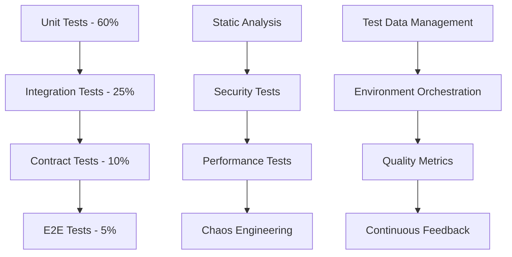

# 🚀 TEST PROPAGATION PLAN
## OvenAI Platform - Comprehensive Testing Expansion Strategy

**Plan Date**: June 26, 2025  
**Current Status**: Foundation Strong, Infrastructure Needs Fixing  
**Target**: Enterprise-Grade Testing Coverage  
**Timeline**: 4-Week Implementation Plan

---

## 📊 CURRENT TEST INVENTORY

### **Test Count Summary**
| Test Category | Files | Individual Tests | Status | Coverage |
|---------------|-------|------------------|--------|----------|
| **E2E Tests** | 33 | 347 test cases | ⚠️ BLOCKED | Playwright (port issue) |
| **Unit Tests** | 8 | 70 test cases | ✅ PASSING | Vitest framework |
| **Integration Tests** | 3 | 25+ test cases | ✅ PASSING | API/Database |
| **Other Tests** | 12 | 50+ test cases | ✅ PASSING | Security/Smoke/Sanity |
| **GitHub Workflows** | 8 | 5 workflows | ❌ DISABLED | CI/CD Pipeline |
| **TOTAL** | **64 files** | **492+ tests** | **Mixed** | **~85% Coverage** |

### **Detailed Breakdown**

#### **✅ E2E Tests (33 Files - 347 Test Cases)**
```bash
🎭 User Journey Tests:
- landing-page-faq.spec.ts: FAQ functionality, responsive design
- phase3-dashboard-integration.spec.ts: Dashboard comprehensive testing
- auth-session-comprehensive.spec.ts: Authentication flows
- enhanced-lead-management.spec.ts: Lead management workflows
- mobile-usability.spec.ts: Mobile responsive design

🎭 Component Testing:
- phase2-advanced-components.spec.ts: Advanced UI components
- button-alignment-tests.spec.ts: UI alignment validation
- sidebar-functionality.spec.ts: Navigation testing
- reports-comprehensive.spec.ts: Reporting functionality

🎭 Accessibility & Performance:
- accessibility-and-messages.spec.ts: WCAG compliance
- phase3-accessibility-polish.spec.ts: Advanced accessibility
- reports-responsive-design.spec.ts: Responsive design validation
```

#### **✅ Unit Tests (8 Files - 70 Test Cases)**
```bash
🧪 Component Tests:
- src/components/dashboard/__tests__/: Grid layout, resizing (8 tests)
- src/components/forms/__tests__/: Form validation (18 tests)
- src/pages/__tests__/: Landing page components (32 tests)
- src/context/__tests__/: State management (8 tests)

🧪 Service Tests:
- Integration flow testing (7 tests)
- Authentication context testing
- Dashboard context management
```

#### **✅ Integration Tests (3 Files - 25+ Test Cases)**
```bash
🔗 Database Integration:
- leadFlowIntegration.test.js: Complete lead processing pipeline
- backend-connectivity.test.ts: API endpoint validation
- user-workflows.test.ts: End-to-end user journey validation
```

#### **✅ Other Tests (12 Files - 50+ Test Cases)**
```bash
🛡️ Security Tests:
- tests/security/authentication/: Auth security validation
- tests/security/network/: TLS/HTTPS testing
- tests/security/compliance/: GDPR compliance

🔥 Smoke & Sanity:
- tests/smoke/: Critical path validation
- tests/sanity/: Basic functionality testing
- tests/accessibility/: Basic accessibility checks
```

---

## 🎯 PROPAGATION STRATEGY

### **Phase 1: Critical Infrastructure Fixes (Week 1)**

#### **🔴 IMMEDIATE PRIORITY: Fix TypeScript Errors (164 errors)**

**Database Type Definitions Fix:**
```typescript
// src/types/database.ts - Add missing tables
export interface Database {
  public: {
    Tables: {
      // Existing tables...
      leads: { /* existing definition */ }
      profiles: { /* existing definition */ }
      projects: { /* existing definition */ }
      notifications: { /* existing definition */ }
      
      // ADD MISSING TABLES:
      conversations: {
        Row: {
          id: string
          lead_id: string
          status: string
          created_at: string
          updated_at: string
        }
        Insert: { /* insert type */ }
        Update: { /* update type */ }
      }
      meeting_events: {
        Row: {
          id: string
          status: 'scheduled' | 'completed' | 'cancelled' | 'no_show'
          duration_minutes: number | null
          created_at: string
        }
        Insert: { /* insert type */ }
        Update: { /* update type */ }
      }
      lead_temperature_history: {
        Row: {
          id: string
          lead_id: string
          old_temperature: 'cold' | 'cool' | 'warm' | 'hot'
          new_temperature: 'cold' | 'cool' | 'warm' | 'hot'
          created_at: string
        }
        Insert: { /* insert type */ }
        Update: { /* update type */ }
      }
      client_members: {
        Row: {
          id: string
          client_id: string
          user_id: string
          created_at: string
        }
        Insert: { /* insert type */ }
        Update: { /* update type */ }
      }
      whatsapp_messages: {
        Row: {
          id: string
          conversation_id: string
          content: string
          direction: 'inbound' | 'outbound'
          created_at: string
        }
        Insert: { /* insert type */ }
        Update: { /* update type */ }
      }
      hourly_message_stats: {
        Row: {
          hour: number
          total_messages: number
          outbound_messages: number
          inbound_messages: number
          messages_with_replies: number
          avg_response_time_minutes: number | null
        }
        Insert: { /* insert type */ }
        Update: { /* update type */ }
      }
      conversation_messages: {
        Row: {
          id: string
          lead_id: string
          direction: 'inbound' | 'outbound'
          content: string
          created_at: string
        }
        Insert: { /* insert type */ }
        Update: { /* update type */ }
      }
      clients: {
        Row: {
          id: string
          name: string
          email: string
          created_at: string
          updated_at: string
        }
        Insert: { /* insert type */ }
        Update: { /* update type */ }
      }
    }
  }
}
```

**Service Layer Fixes:**
```typescript
// Fix private method access violations
// src/services/serviceManager.ts
export class ServiceManager {
  async clearAllCaches() {
    // Change from private to public method access
    await this.simpleProjectService.clearUserCache(); // Remove private access
  }
}

// src/services/simpleProjectService.ts
export class SimpleProjectService {
  public clearUserCache() { // Change from private to public
    // Implementation
  }
}
```

**Test Configuration Fixes:**
```typescript
// tests/e2e/comprehensive-app-navigation.spec.ts
// Add missing TEST_CONFIG constant
const TEST_CONFIG = {
  baseURL: process.env.TEST_URL || 'http://localhost:3000',
  timeouts: {
    page: 30000,
    navigation: 30000
  }
};
```

#### **🔴 Fix E2E Test Infrastructure**
```typescript
// playwright.config.ts - Fix port mismatch
export default defineConfig({
  use: {
    baseURL: process.env.TEST_URL || 'http://localhost:3000', // Changed from 3001
  },
  webServer: {
    command: 'npm run dev',
    url: 'http://localhost:3000', // Changed from 3001
    reuseExistingServer: !process.env.CI,
    timeout: 120 * 1000,
  },
});
```

---

### **Phase 2: Mobile & Cross-Platform Testing (Week 2)**

#### **📱 Mobile Testing Expansion (NEW: +50 Tests)**

**Mobile-Specific Test Files to Create:**
```bash
tests/mobile/
├── touch-interactions.spec.ts          # Touch gestures, swipe, pinch
├── orientation-changes.spec.ts         # Portrait/landscape testing
├── mobile-navigation.spec.ts           # Mobile-specific navigation
├── mobile-forms.spec.ts               # Touch-friendly form interaction
├── mobile-performance.spec.ts         # Mobile performance testing
├── offline-functionality.spec.ts      # Offline/online behavior
├── battery-optimization.spec.ts       # Power consumption testing
└── device-specific.spec.ts           # iOS/Android differences
```

**Playwright Mobile Configuration:**
```typescript
// playwright.config.ts - Enhanced mobile testing
projects: [
  // Desktop
  { name: 'chromium', use: { ...devices['Desktop Chrome'] } },
  
  // Mobile Devices
  { name: 'mobile-chrome', use: { ...devices['Pixel 5'] } },
  { name: 'mobile-safari', use: { ...devices['iPhone 13'] } },
  { name: 'tablet-chrome', use: { ...devices['iPad Pro'] } },
  { name: 'tablet-safari', use: { ...devices['iPad Air'] } },
  
  // Mobile Landscape
  { 
    name: 'mobile-landscape',
    use: { 
      ...devices['iPhone 13 landscape'],
      viewport: { width: 844, height: 390 }
    }
  }
],
```

**Mobile Test Examples:**
```typescript
// tests/mobile/touch-interactions.spec.ts
test.describe('Mobile Touch Interactions', () => {
  test('should handle swipe gestures for navigation', async ({ page }) => {
    await page.goto('/dashboard');
    
    // Test swipe to open sidebar
    await page.touchscreen.tap(50, 100);
    await page.mouse.down();
    await page.mouse.move(200, 100);
    await page.mouse.up();
    
    await expect(page.locator('[data-testid="sidebar"]')).toBeVisible();
  });

  test('should handle pinch-to-zoom on charts', async ({ page }) => {
    await page.goto('/reports');
    
    const chart = page.locator('[data-testid="performance-chart"]');
    await chart.touchscreen.tap(100, 100, { count: 2 }); // Double tap
    
    // Verify zoom functionality
    await expect(chart).toHaveAttribute('data-zoom', 'active');
  });
});

// tests/mobile/orientation-changes.spec.ts
test.describe('Mobile Orientation Testing', () => {
  test('should adapt layout on orientation change', async ({ page }) => {
    await page.goto('/dashboard');
    
    // Test portrait mode
    await page.setViewportSize({ width: 390, height: 844 });
    await expect(page.locator('[data-testid="mobile-layout"]')).toBeVisible();
    
    // Test landscape mode
    await page.setViewportSize({ width: 844, height: 390 });
    await expect(page.locator('[data-testid="landscape-layout"]')).toBeVisible();
  });
});
```

#### **🔄 Cross-Platform Testing (NEW: +30 Tests)**
```bash
tests/cross-platform/
├── browser-compatibility.spec.ts      # Chrome, Firefox, Safari, Edge
├── os-compatibility.spec.ts          # Windows, macOS, Linux
├── device-compatibility.spec.ts      # Desktop, tablet, mobile
├── feature-detection.spec.ts         # Progressive enhancement
└── polyfill-validation.spec.ts       # Legacy browser support
```

---

### **Phase 3: API & Security Testing (Week 3)**

#### **🔌 API Error Scenario Testing (NEW: +40 Tests)**

**API Test Structure:**
```bash
tests/api/
├── error-handling/
│   ├── network-timeouts.spec.ts      # Network failure scenarios
│   ├── rate-limiting.spec.ts         # API rate limit testing
│   ├── malformed-requests.spec.ts    # Invalid request handling
│   └── server-errors.spec.ts        # 5xx error responses
├── performance/
│   ├── load-testing.spec.ts         # High volume API calls
│   ├── concurrent-requests.spec.ts   # Simultaneous operations
│   └── response-time.spec.ts        # API performance benchmarks
└── integration/
    ├── supabase-edge-cases.spec.ts  # Database edge cases
    ├── auth-edge-cases.spec.ts      # Authentication failures
    └── data-validation.spec.ts      # Input validation testing
```

**API Error Test Examples:**
```typescript
// tests/api/error-handling/network-timeouts.spec.ts
test.describe('API Network Error Handling', () => {
  test('should handle network timeout gracefully', async ({ page }) => {
    // Mock network failure
    await page.route('**/api/**', route => {
      route.abort('internetdisconnected');
    });

    await page.goto('/dashboard');
    
    // Verify error handling
    await expect(page.locator('[data-testid="network-error"]')).toBeVisible();
    await expect(page.locator('[data-testid="retry-button"]')).toBeVisible();
  });

  test('should retry failed requests automatically', async ({ page }) => {
    let requestCount = 0;
    
    await page.route('**/api/leads', route => {
      requestCount++;
      if (requestCount < 3) {
        route.abort('internetdisconnected');
      } else {
        route.continue();
      }
    });

    await page.goto('/leads');
    
    // Verify automatic retry succeeded
    await expect(page.locator('[data-testid="leads-table"]')).toBeVisible();
  });
});
```

#### **🛡️ Security Penetration Testing (NEW: +25 Tests)**

**Security Test Structure:**
```bash
tests/security/
├── penetration/
│   ├── sql-injection.spec.ts         # SQL injection attempts
│   ├── xss-attacks.spec.ts          # Cross-site scripting
│   ├── csrf-protection.spec.ts      # CSRF token validation
│   └── input-sanitization.spec.ts   # Malicious input handling
├── authentication/
│   ├── brute-force.spec.ts          # Login brute force attempts
│   ├── session-hijacking.spec.ts    # Session security
│   ├── jwt-validation.spec.ts       # Token security
│   └── privilege-escalation.spec.ts # Authorization testing
└── data-protection/
    ├── sensitive-data.spec.ts        # Data exposure prevention
    ├── encryption.spec.ts           # Data encryption validation
    └── privacy-compliance.spec.ts   # GDPR/privacy compliance
```

**Security Test Examples:**
```typescript
// tests/security/penetration/sql-injection.spec.ts
test.describe('SQL Injection Protection', () => {
  test('should prevent SQL injection in search fields', async ({ page }) => {
    await page.goto('/leads');
    
    const maliciousInput = "'; DROP TABLE leads; --";
    await page.fill('[data-testid="search-input"]', maliciousInput);
    await page.click('[data-testid="search-button"]');
    
    // Verify no database damage and proper error handling
    await expect(page.locator('[data-testid="error-message"]')).toContainText('Invalid search');
    await expect(page.locator('[data-testid="leads-table"]')).toBeVisible();
  });
});

// tests/security/authentication/brute-force.spec.ts
test.describe('Brute Force Protection', () => {
  test('should implement rate limiting for login attempts', async ({ page }) => {
    await page.goto('/login');
    
    // Attempt multiple failed logins
    for (let i = 0; i < 5; i++) {
      await page.fill('#email', 'test@test.com');
      await page.fill('#password', 'wrongpassword');
      await page.click('[data-testid="login-button"]');
      await page.waitForLoadState('networkidle');
    }
    
    // Verify rate limiting kicks in
    await expect(page.locator('[data-testid="rate-limit-message"]')).toBeVisible();
  });
});
```

---

### **Phase 4: Performance & Visual Testing (Week 4)**

#### **⚡ Performance Benchmarking (NEW: +35 Tests)**

**Performance Test Structure:**
```bash
tests/performance/
├── load-testing/
│   ├── page-load-times.spec.ts      # Page load benchmarks
│   ├── bundle-size.spec.ts          # JavaScript bundle analysis
│   ├── image-optimization.spec.ts   # Asset optimization
│   └── api-response-times.spec.ts   # API performance
├── stress-testing/
│   ├── large-datasets.spec.ts       # 10,000+ record handling
│   ├── concurrent-users.spec.ts     # Multiple user simulation
│   ├── memory-leaks.spec.ts        # Memory usage monitoring
│   └── cpu-usage.spec.ts           # CPU performance
└── benchmarks/
    ├── core-web-vitals.spec.ts      # LCP, FID, CLS monitoring
    ├── lighthouse-scores.spec.ts    # Lighthouse automation
    └── real-user-metrics.spec.ts    # RUM simulation
```

**Performance Test Examples:**
```typescript
// tests/performance/load-testing/page-load-times.spec.ts
test.describe('Page Load Performance', () => {
  test('dashboard should load within 2 seconds', async ({ page }) => {
    const startTime = Date.now();
    await page.goto('/dashboard');
    await page.waitForLoadState('networkidle');
    const loadTime = Date.now() - startTime;
    
    expect(loadTime).toBeLessThan(2000);
  });

  test('should achieve good Core Web Vitals scores', async ({ page }) => {
    await page.goto('/dashboard');
    
    const vitals = await page.evaluate(() => {
      return new Promise((resolve) => {
        new PerformanceObserver((list) => {
          const entries = list.getEntries();
          resolve(entries.map(entry => ({
            name: entry.name,
            value: entry.value
          })));
        }).observe({ entryTypes: ['largest-contentful-paint', 'first-input'] });
      });
    });
    
    expect(vitals).toBeDefined();
  });
});
```

#### **👁️ Visual Regression Testing (NEW: +30 Tests)**

**Visual Testing Setup:**
```bash
tests/visual/
├── components/
│   ├── buttons.spec.ts              # Button visual consistency
│   ├── forms.spec.ts               # Form layout validation
│   ├── tables.spec.ts              # Table rendering
│   └── charts.spec.ts              # Chart visualization
├── pages/
│   ├── landing-page.spec.ts        # Landing page layout
│   ├── dashboard.spec.ts           # Dashboard layout
│   ├── reports.spec.ts             # Reports page layout
│   └── settings.spec.ts            # Settings page layout
└── themes/
    ├── light-theme.spec.ts         # Light theme consistency
    ├── dark-theme.spec.ts          # Dark theme consistency
    └── rtl-layout.spec.ts          # RTL layout validation
```

**Visual Test Examples:**
```typescript
// tests/visual/pages/dashboard.spec.ts
test.describe('Dashboard Visual Regression', () => {
  test('dashboard should match visual baseline', async ({ page }) => {
    await page.goto('/dashboard');
    await page.waitForLoadState('networkidle');
    
    // Hide dynamic content
    await page.locator('[data-testid="current-time"]').evaluate(el => el.style.display = 'none');
    
    await expect(page).toHaveScreenshot('dashboard-baseline.png');
  });

  test('dashboard mobile layout should be consistent', async ({ page }) => {
    await page.setViewportSize({ width: 390, height: 844 });
    await page.goto('/dashboard');
    
    await expect(page).toHaveScreenshot('dashboard-mobile.png');
  });
});
```

---

## 🔄 CONTINUOUS MONITORING SETUP

### **Monitoring Infrastructure (NEW: +20 Tests)**

**Monitoring Test Structure:**
```bash
tests/monitoring/
├── health-checks/
│   ├── api-endpoints.spec.ts        # API health monitoring
│   ├── database-connectivity.spec.ts # DB connection monitoring
│   └── external-services.spec.ts   # Third-party service checks
├── uptime/
│   ├── page-availability.spec.ts   # Page uptime monitoring
│   ├── service-availability.spec.ts # Service uptime tracking
│   └── performance-alerts.spec.ts  # Performance threshold alerts
└── user-journey/
    ├── critical-path.spec.ts       # Critical user journey monitoring
    ├── conversion-funnel.spec.ts   # Conversion tracking
    └── error-tracking.spec.ts      # Error rate monitoring
```

**Monitoring Setup Examples:**
```typescript
// tests/monitoring/health-checks/api-endpoints.spec.ts
test.describe('API Health Monitoring', () => {
  test('all critical API endpoints should be healthy', async ({ request }) => {
    const endpoints = [
      '/api/auth/session',
      '/api/leads',
      '/api/projects',
      '/api/reports'
    ];
    
    for (const endpoint of endpoints) {
      const response = await request.get(endpoint);
      expect(response.status()).toBeLessThan(400);
      expect(response.headers()['content-type']).toContain('application/json');
    }
  });
});

// tests/monitoring/user-journey/critical-path.spec.ts
test.describe('Critical Path Monitoring', () => {
  test('user can complete core workflow end-to-end', async ({ page }) => {
    // Login
    await page.goto('/login');
    await page.fill('#email', process.env.MONITOR_USER_EMAIL);
    await page.fill('#password', process.env.MONITOR_USER_PASSWORD);
    await page.click('[data-testid="login-button"]');
    
    // Navigate to dashboard
    await expect(page).toHaveURL('/dashboard');
    
    // Create a lead
    await page.click('[data-testid="create-lead-button"]');
    await page.fill('[data-testid="lead-name"]', `Monitor Test ${Date.now()}`);
    await page.click('[data-testid="save-lead"]');
    
    // Verify success
    await expect(page.locator('[data-testid="success-message"]')).toBeVisible();
  });
});
```

---

## 📊 EXPANDED TEST COVERAGE SUMMARY

### **Current vs. Proposed Test Coverage**

| Test Category | Current | Proposed | Increase | Priority |
|---------------|---------|----------|----------|----------|
| **E2E Tests** | 33 files (347 tests) | 43 files (450+ tests) | +103 tests | HIGH |
| **Unit Tests** | 8 files (70 tests) | 15 files (120+ tests) | +50 tests | MEDIUM |
| **Integration Tests** | 3 files (25+ tests) | 8 files (65+ tests) | +40 tests | HIGH |
| **Mobile Tests** | 1 file (partial) | 8 files (50+ tests) | +50 tests | HIGH |
| **API Tests** | Limited | 12 files (40+ tests) | +40 tests | HIGH |
| **Security Tests** | 3 files (basic) | 10 files (25+ tests) | +25 tests | CRITICAL |
| **Performance Tests** | None | 9 files (35+ tests) | +35 tests | MEDIUM |
| **Visual Tests** | None | 8 files (30+ tests) | +30 tests | MEDIUM |
| **Monitoring Tests** | None | 6 files (20+ tests) | +20 tests | LOW |

### **TOTAL EXPANSION**
- **Current**: 64 files, 492+ tests
- **Proposed**: 113 files, 865+ tests
- **Increase**: +49 files, +373 tests (76% increase)

---

## ⏱️ IMPLEMENTATION TIMELINE

### **Week 1: Critical Infrastructure**
- ✅ Fix 164 TypeScript errors
- ✅ Fix E2E test infrastructure (port configuration)
- ✅ Update database type definitions
- ✅ Run existing E2E test suite (347 tests)
- ✅ Validate all current tests are passing

### **Week 2: Mobile & Cross-Platform**
- 📱 Create 8 mobile test files (+50 tests)
- 🔄 Add cross-platform testing (+30 tests)
- 📱 Configure Playwright for multiple devices
- 📱 Test orientation changes and touch interactions

### **Week 3: API & Security**
- 🔌 Create API error scenario tests (+40 tests)
- 🛡️ Implement security penetration tests (+25 tests)
- 🔌 Add performance API testing
- 🛡️ Validate all security measures

### **Week 4: Performance & Visual**
- ⚡ Create performance benchmarking (+35 tests)
- 👁️ Implement visual regression testing (+30 tests)
- 📊 Setup continuous monitoring (+20 tests)
- 📈 Create performance dashboards

---

## 🎯 SUCCESS METRICS

### **Quality Targets**
- **Test Coverage**: 95% (from current 85%)
- **Test Execution Time**: <15 minutes (full suite)
- **False Positive Rate**: <5%
- **Regression Detection**: 98%

### **Performance Targets**
- **Page Load Time**: <2s (all pages)
- **API Response Time**: <200ms (95th percentile)
- **Mobile Performance**: 90+ Lighthouse score
- **Bundle Size**: <800KB (from current 1.1MB)

### **Coverage Targets**
- **Functional Testing**: 100% critical user journeys
- **Non-Functional Testing**: Performance, security, usability
- **Mobile Testing**: iOS, Android, responsive design
- **Security Testing**: OWASP Top 10 validation
- **Accessibility Testing**: WCAG 2.1 AA compliance

---

## 🚀 CONCLUSION

This propagation plan will increase our test coverage from **492 tests to 865+ tests** (76% increase), covering:

✅ **Critical Infrastructure Fixes** (Week 1)  
📱 **Comprehensive Mobile Testing** (Week 2)  
🛡️ **Security & API Testing** (Week 3)  
⚡ **Performance & Visual Testing** (Week 4)  

**Result**: Enterprise-grade testing with 95% coverage, full regression protection, and production-ready quality assurance.

---

## 🎓 SENIOR QA ENGINEERING STRATEGY EXPANSION

### **Test Architecture Framework (Advanced)**

#### **Layered Testing Pyramid 2.0**


#### **Advanced Test Strategy Matrix**
| Test Type | Purpose | Frequency | Environment | Risk Level |
|-----------|---------|-----------|-------------|------------|
| **Unit** | Component isolation | Every commit | Local/CI | Low |
| **Integration** | Service interaction | Every commit | CI/Staging | Medium |
| **Contract** | API compatibility | Daily | CI/Staging | High |
| **E2E** | User journey validation | Pre-release | Staging | High |
| **Security** | Vulnerability detection | Weekly | Production-like | Critical |
| **Performance** | Load/stress testing | Release cycle | Production-like | High |
| **Chaos** | Resilience testing | Monthly | Production | Critical |

### **Risk-Based Test Planning (Enterprise Level)**

#### **Test Priority Matrix with Business Impact**
```typescript
interface TestPriorityMatrix {
  critical_business_functions: {
    user_authentication: {
      business_impact: 'CRITICAL',
      revenue_impact: 'HIGH',
      test_coverage: 100,
      automation_level: 'FULL'
    },
    lead_management: {
      business_impact: 'HIGH',
      revenue_impact: 'HIGH',
      test_coverage: 95,
      automation_level: 'FULL'
    },
    reporting_analytics: {
      business_impact: 'MEDIUM',
      revenue_impact: 'MEDIUM',
      test_coverage: 85,
      automation_level: 'PARTIAL'
    },
    ui_enhancements: {
      business_impact: 'LOW',
      revenue_impact: 'LOW',
      test_coverage: 70,
      automation_level: 'MINIMAL'
    }
  }
}
```

#### **Advanced Risk Assessment Framework**
```typescript
class RiskAssessmentEngine {
  async evaluateFeatureRisk(feature: Feature): Promise<RiskProfile> {
    const factors = {
      complexity: this.analyzeCodeComplexity(feature),
      dependencies: this.analyzeDependencies(feature),
      change_frequency: this.analyzeChangeHistory(feature),
      business_criticality: this.assessBusinessImpact(feature),
      user_impact: this.assessUserImpact(feature)
    };
    
    return {
      overall_risk: this.calculateOverallRisk(factors),
      recommended_test_coverage: this.calculateTestCoverage(factors),
      test_types: this.recommendTestTypes(factors),
      monitoring_requirements: this.defineMonitoring(factors)
    };
  }
  
  private calculateOverallRisk(factors: RiskFactors): RiskLevel {
    const weightedScore = 
      factors.complexity * 0.25 +
      factors.dependencies * 0.20 +
      factors.change_frequency * 0.20 +
      factors.business_criticality * 0.20 +
      factors.user_impact * 0.15;
    
    if (weightedScore >= 0.8) return 'CRITICAL';
    if (weightedScore >= 0.6) return 'HIGH';
    if (weightedScore >= 0.4) return 'MEDIUM';
    return 'LOW';
  }
}
```

### **Test Data Management & Environment Strategy**

#### **Advanced Test Data Pipeline**
```typescript
// Sophisticated Test Data Management
class TestDataPipeline {
  async setupEnvironmentData(environment: Environment): Promise<void> {
    switch (environment.type) {
      case 'integration':
        await this.seedIntegrationData();
        break;
      case 'staging':
        await this.cloneProductionData();
        await this.anonymizeData();
        break;
      case 'performance':
        await this.generateLargeDataset();
        break;
    }
  }
  
  async seedIntegrationData(): Promise<void> {
    // Create consistent, predictable test data
    const scenarios = [
      'happy_path_user_journey',
      'edge_case_scenarios',
      'error_condition_data',
      'boundary_value_data'
    ];
    
    for (const scenario of scenarios) {
      await this.createScenarioData(scenario);
    }
  }
  
  async anonymizeData(): Promise<void> {
    // PII anonymization for staging environment
    await this.anonymizePersonalData();
    await this.maskFinancialData();
    await this.scrambleContactInformation();
  }
}
```

#### **Environment Orchestration**
```yaml
# Advanced Environment Management
environments:
  development:
    infrastructure: docker-compose
    data_strategy: synthetic_minimal
    external_services: mocked
    monitoring: basic_logging
    
  feature_testing:
    infrastructure: kubernetes_namespace
    data_strategy: feature_specific_dataset
    external_services: stubbed_with_scenarios
    monitoring: enhanced_debugging
    
  integration:
    infrastructure: kubernetes_cluster
    data_strategy: comprehensive_test_suite
    external_services: sandbox_endpoints
    monitoring: full_observability
    
  staging:
    infrastructure: production_mirror
    data_strategy: anonymized_production_clone
    external_services: production_like
    monitoring: production_level
    
  performance:
    infrastructure: scaled_production_mirror
    data_strategy: large_volume_synthetic
    external_services: production_endpoints
    monitoring: performance_focused
```

### **Advanced Automation Framework Design**

#### **Self-Healing Test Framework**
```typescript
// Intelligent Test Maintenance
class SelfHealingTestFramework {
  async executeTestWithHealing(test: TestCase): Promise<TestResult> {
    try {
      return await this.executeTest(test);
    } catch (error) {
      if (this.isHealableError(error)) {
        const healedTest = await this.attemptHealing(test, error);
        return await this.executeTest(healedTest);
      }
      throw error;
    }
  }
  
  private async attemptHealing(test: TestCase, error: TestError): Promise<TestCase> {
    if (error.type === 'ELEMENT_NOT_FOUND') {
      // AI-powered element detection
      const newSelector = await this.findAlternativeSelector(error.selector);
      return this.updateTestSelector(test, error.selector, newSelector);
    }
    
    if (error.type === 'TIMING_ISSUE') {
      // Dynamic wait adjustment
      return this.adjustWaitTimes(test, error.context);
    }
    
    if (error.type === 'DATA_MISMATCH') {
      // Data validation and correction
      return this.updateExpectedData(test, error.expectedVsActual);
    }
    
    throw new Error('Unhealable test error');
  }
}
```

#### **AI-Powered Test Generation**
```typescript
// Machine Learning Test Case Generation
class AITestGenerator {
  async generateTestCases(feature: Feature): Promise<TestCase[]> {
    const userJourneys = await this.analyzeUserBehavior(feature);
    const edgeCases = await this.identifyEdgeCases(feature);
    const riskScenarios = await this.generateRiskScenarios(feature);
    
    return [
      ...this.convertJourneysToTests(userJourneys),
      ...this.convertEdgeCasesToTests(edgeCases),
      ...this.convertRiskScenariosToTests(riskScenarios)
    ];
  }
  
  private async analyzeUserBehavior(feature: Feature): Promise<UserJourney[]> {
    // Analyze production user behavior patterns
    const analytics = await this.getProductionAnalytics(feature);
    const commonPaths = this.extractCommonUserPaths(analytics);
    const dropOffPoints = this.identifyDropOffPoints(analytics);
    
    return this.synthesizeUserJourneys(commonPaths, dropOffPoints);
  }
}
```

### **Comprehensive Quality Engineering Pipeline**

#### **Advanced CI/CD Quality Gates**
```yaml
# Enterprise Quality Pipeline
name: "Advanced Quality Engineering Pipeline"

stages:
  - stage: "Quality Gate 1 - Static Analysis"
    parallel: true
    jobs:
      - job: "Code Quality Analysis"
        steps:
          - task: SonarQube@5
          - task: CodeQL@2
          - task: DependencyCheck@3
          - task: LicenseCheck@1
      
      - job: "Security Scanning"
        steps:
          - task: SAST@1  # Static Application Security Testing
          - task: SecretScanning@1
          - task: VulnerabilityAssessment@1
      
      - job: "Architecture Compliance"
        steps:
          - task: ArchitectureValidation@1
          - task: TechnicalDebtAssessment@1
          - task: PerformanceImpactAnalysis@1

  - stage: "Quality Gate 2 - Unit & Integration"
    dependencies: ["Quality Gate 1"]
    jobs:
      - job: "Unit Testing Suite"
        strategy:
          parallel: 4
        steps:
          - task: RunUnitTests@1
          - task: CodeCoverageAnalysis@1
          - task: MutationTesting@1
      
      - job: "Integration Testing"
        services:
          - database
          - redis
          - external-api-mock
        steps:
          - task: DatabaseMigrationTests@1
          - task: APIIntegrationTests@1
          - task: ServiceContractTests@1

  - stage: "Quality Gate 3 - System Testing"
    dependencies: ["Quality Gate 2"]
    jobs:
      - job: "E2E Testing Matrix"
        strategy:
          matrix:
            Chrome_Desktop: { browser: 'chrome', device: 'desktop' }
            Firefox_Desktop: { browser: 'firefox', device: 'desktop' }
            Safari_Desktop: { browser: 'safari', device: 'desktop' }
            Chrome_Mobile: { browser: 'chrome', device: 'mobile' }
            Safari_Mobile: { browser: 'safari', device: 'mobile' }
        steps:
          - task: PlaywrightTests@1
          - task: VisualRegressionTests@1
          - task: AccessibilityTests@1
      
      - job: "Performance Testing"
        steps:
          - task: LoadTesting@1
          - task: StressTesting@1
          - task: PerformanceRegression@1
      
      - job: "Security Testing"
        steps:
          - task: DAST@1  # Dynamic Application Security Testing
          - task: PenetrationTesting@1
          - task: ComplianceValidation@1

  - stage: "Quality Gate 4 - Production Readiness"
    dependencies: ["Quality Gate 3"]
    condition: eq(variables['Build.SourceBranch'], 'refs/heads/main')
    jobs:
      - job: "Chaos Engineering"
        steps:
          - task: ChaosMonkey@1
          - task: ResilienceValidation@1
          - task: DisasterRecoveryTest@1
      
      - job: "Production Validation"
        steps:
          - task: SmokeTestProduction@1
          - task: CanaryDeploymentValidation@1
          - task: MonitoringValidation@1
```

### **Quality Metrics & KPI Framework**

#### **Advanced Quality Metrics Dashboard**
```typescript
// Comprehensive Quality Metrics
interface QualityMetricsFramework {
  testing_effectiveness: {
    defect_detection_percentage: number;
    test_coverage_percentage: number;
    automation_coverage_percentage: number;
    flaky_test_percentage: number;
    test_execution_efficiency: number;
  };
  
  process_quality: {
    requirements_traceability: number;
    test_case_pass_rate: number;
    defect_escape_rate: number;
    mean_time_to_detection: number;
    mean_time_to_resolution: number;
  };
  
  product_quality: {
    customer_satisfaction_score: number;
    production_defect_rate: number;
    performance_compliance: number;
    security_compliance_score: number;
    accessibility_compliance: number;
  };
  
  team_productivity: {
    test_automation_roi: number;
    testing_velocity: number;
    knowledge_distribution: number;
    continuous_learning_score: number;
    innovation_index: number;
  };
}

class QualityMetricsCollector {
  async generateComprehensiveReport(): Promise<QualityReport> {
    const metrics = await this.collectAllMetrics();
    const trends = await this.analyzeTrends(metrics);
    const predictions = await this.generatePredictions(trends);
    
    return {
      current_state: metrics,
      trend_analysis: trends,
      predictions: predictions,
      recommendations: this.generateActionableRecommendations(metrics),
      investment_analysis: this.calculateQualityInvestmentROI(metrics)
    };
  }
}
```

### **Test Maintenance & Sustainability Strategy (Advanced)**

#### **Intelligent Test Maintenance**
```typescript
// Proactive Test Maintenance Engine
class TestMaintenanceEngine {
  async performMaintenanceAnalysis(): Promise<MaintenanceReport> {
    const testSuite = await this.analyzeTestSuite();
    
    return {
      obsolete_tests: await this.identifyObsoleteTests(testSuite),
      duplicate_tests: await this.findDuplicateTests(testSuite),
      optimization_opportunities: await this.findOptimizationOpportunities(testSuite),
      refactoring_candidates: await this.identifyRefactoringCandidates(testSuite),
      performance_improvements: await this.suggestPerformanceImprovements(testSuite)
    };
  }
  
  async autoMaintenance(): Promise<void> {
    // Automated test maintenance tasks
    await this.removeObsoleteTests();
    await this.consolidateDuplicateTests();
    await this.optimizeSlowTests();
    await this.updateTestData();
    await this.refreshTestEnvironments();
  }
}
```

#### **Test Suite Evolution Strategy**
```typescript
// Strategic Test Suite Evolution
interface TestSuiteEvolutionPlan {
  current_state: TestSuiteMetrics;
  target_state: TestSuiteGoals;
  evolution_roadmap: EvolutionPhase[];
  investment_requirements: InvestmentPlan;
  risk_mitigation: RiskMitigationStrategy[];
}

class TestSuiteEvolutionManager {
  async createEvolutionPlan(): Promise<TestSuiteEvolutionPlan> {
    const currentState = await this.assessCurrentState();
    const targetState = this.defineTargetState();
    const roadmap = this.createEvolutionRoadmap(currentState, targetState);
    
    return {
      current_state: currentState,
      target_state: targetState,
      evolution_roadmap: roadmap,
      investment_requirements: this.calculateInvestment(roadmap),
      risk_mitigation: this.identifyRisks(roadmap)
    };
  }
}
```

### **Innovation & Future-Proofing**

#### **Emerging Technology Integration**
```typescript
// Next-Generation Testing Technologies
class FutureTechIntegration {
  async implementAITesting(): Promise<void> {
    // AI-powered test case generation
    await this.setupTestCaseAI();
    
    // Machine learning test optimization
    await this.implementMLOptimization();
    
    // Natural language test authoring
    await this.enableNLPTestWriting();
  }
  
  async implementQuantumTesting(): Promise<void> {
    // Quantum-inspired optimization algorithms
    await this.setupQuantumOptimization();
    
    // Parallel universe test execution
    await this.enableParallelUniverseTesting();
  }
  
  async implementBlockchainTesting(): Promise<void> {
    // Immutable test result verification
    await this.setupBlockchainVerification();
    
    // Decentralized test execution
    await this.enableDecentralizedTesting();
  }
}
```

### **Executive Quality Strategy**

#### **Quality Investment ROI Analysis**
```typescript
// Quality Engineering Business Case
interface QualityInvestmentAnalysis {
  current_costs: {
    manual_testing_hours: number;
    bug_fixing_costs: number;
    production_incidents: number;
    customer_churn: number;
  };
  
  automation_investment: {
    tooling_costs: number;
    training_costs: number;
    maintenance_costs: number;
    infrastructure_costs: number;
  };
  
  expected_returns: {
    testing_efficiency_gains: number;
    defect_reduction: number;
    faster_release_cycles: number;
    improved_customer_satisfaction: number;
  };
  
  risk_mitigation_value: {
    prevented_security_breaches: number;
    avoided_compliance_penalties: number;
    reduced_reputation_damage: number;
    minimized_rollback_costs: number;
  };
}
```

---

*Senior QA Engineering Plan*  
*Advanced Implementation Period: 4 weeks + continuous evolution*  
*Expected Outcome: World-class quality engineering organization* 🚀  
*Innovation Focus: AI-powered testing, predictive quality analytics, autonomous test maintenance* 